# Evidència 1

# Arquitectura PC \- Fonaments de Maquinàri
## Edu Gordo \- CASIX 1

**1.Preparació, obertura i neteja del xassís**

Desconnecta el PC de la xarxa elèctrica, retira els cargols dels panells laterals per extreure la tapa principal i desconnecta el ventilador auxiliar de la placa base per poder retirar la tapa posterior sense obstacles, aprofitant per retirar la pols acumulada al xassís i a les aspes del ventilador amb un pinzell suau o un drap de microfibra lleugerament humit.

**2.Extracció i neteja de la targeta gràfica (GPU):**

 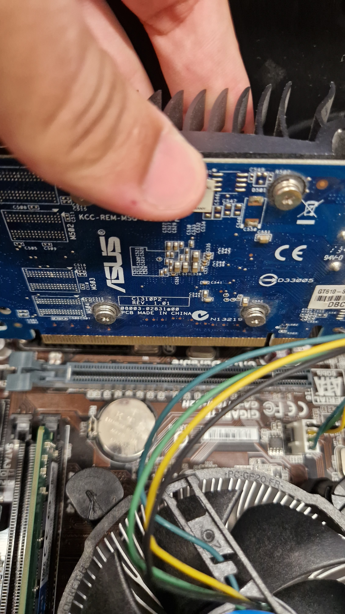

Desconnecta l'alimentació PCIe si en té, desbloqueja la pestanya de seguretat de la ranura PCIe x16 i extreu la targeta gràfica lliscant-la cap amunt de manera vertical, passant després a netejar la pols acumulada al dissipador i aspes amb aire comprimit, a més de repassar la placa de circuit (PCB) amb un pinzell antiestàtic i netejar els seus contactes daurats utilitzant un cotó impregnat en alcohol isopropílic (99%).

**3.Extracció i neteja dels mòduls de memòria RAM:**

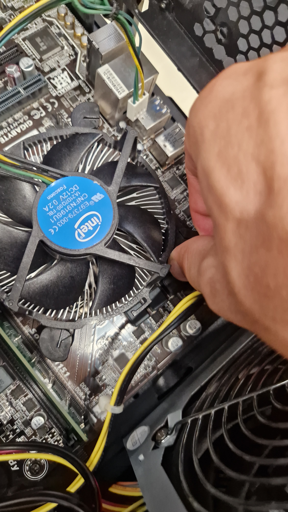 

Obre les pestanyes de fixació dels extrems de les ranures DIMM i estira els mòduls cap amunt en línia recta per extreure'ls, aprofitant per netejar la superfície de la targeta amb un pinzell suau i fregar els contactes daurats amb alcohol isopropílic o una goma d'esborrar neta per eliminar qualsevol residu que pugui afectar la connexió.

**4.Retirada i neteja del sistema de refrigeració de la CPU:**

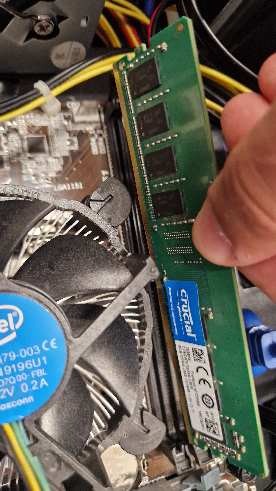  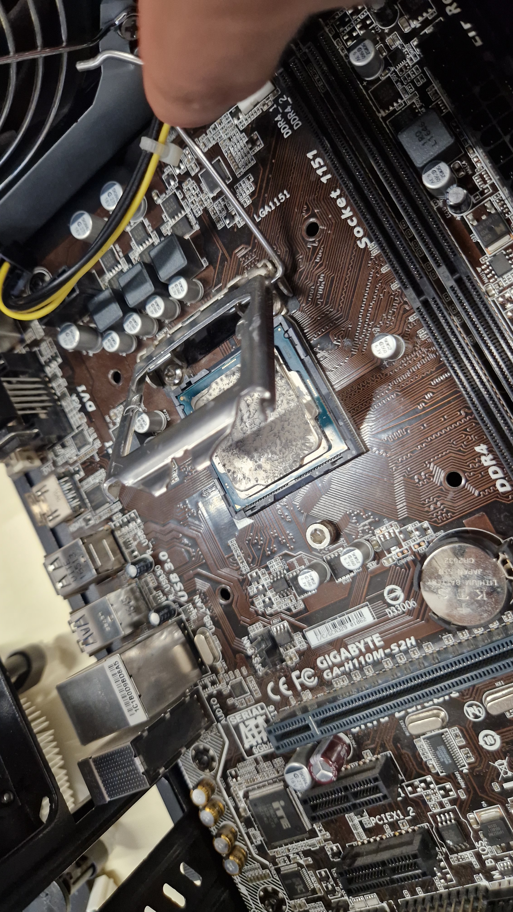

Desconnecta el cable d'alimentació del ventilador de la CPU (capçal CPU\_FAN), desferma el mecanisme de fixació (sigui per pressió o cargols amb gir de 90°) i retira el conjunt de dissipador i ventilador amb cura de no forçar el processador, aplicant aire comprimit entre les aletes de refrigeració per expulsar la pols i retirant la pasta tèrmica petrificada de la seva base amb un paper suau o drap de microfibra xopat en alcohol isopropílic.

**5.Extracció i neteja del processador (CPU):**

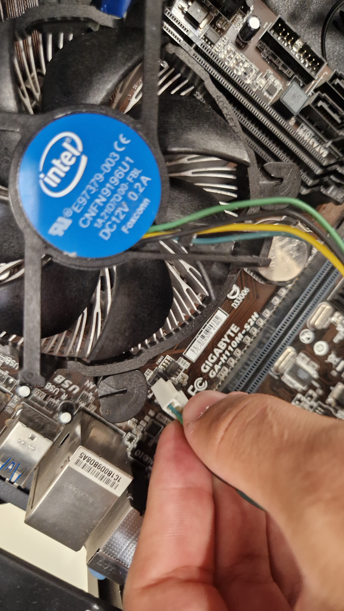

Obre la palanca de fixació del sòcol (socket), aixeca la coberta protectora i extreu el processador agafant-lo pels extrems laterals sense tocar els pins o contactes inferiors, per després retirar acuradament totes les restes de pasta tèrmica antiga de la seva superfície metàl·lica (*IHS*) utilitzant un drap que no deixi residus impregnat amb alcohol isopropílic fins que quedi completament net.

**6.Extracció i neteja de la font d'alimentació (PSU):**

 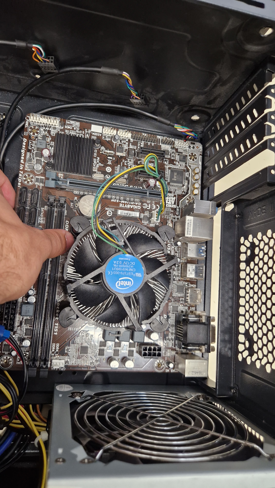 

Retira el panell posterior del xassís per accedir a l'encaminament de cables (*cable management*), desconnecta el connector principal ATX de 24 pins juntament amb la resta del cablatge, descaragola la font de la caixa per extreure-la i aplica ràfegues curtes d'aire comprimit a través de les seves grelles exteriors per expulsar la pols acumulada al seu interior.

**7.Extracció i neteja de la placa base:**

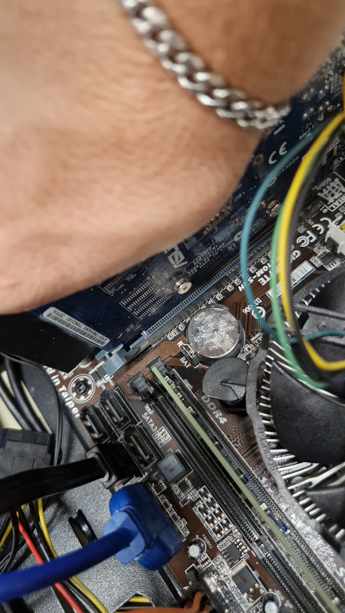 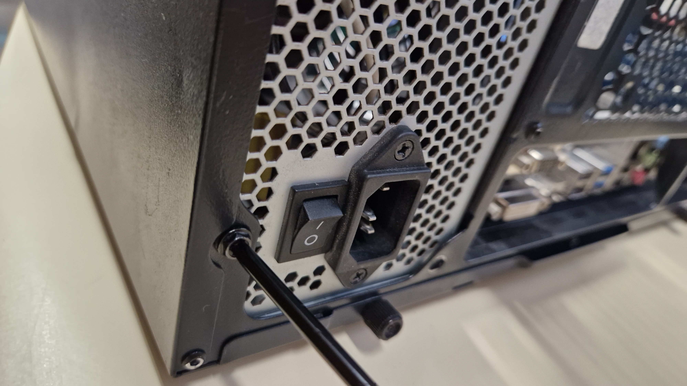

Desconnecta tots els cables restants del panell frontal i SATA, retira els cargols que fixen la placa base als separadors (*standoffs*) de la caixa per poder extreure-la amb cura, i aprofita per netejar la seva superfície, el panell de connexions I/O posterior i l'interior de les ranures PCIe i DIMM utilitzant un pinzell antiestàtic i aire comprimit a una distància de seguretat.

**1.Instal·lació de la placa base:**

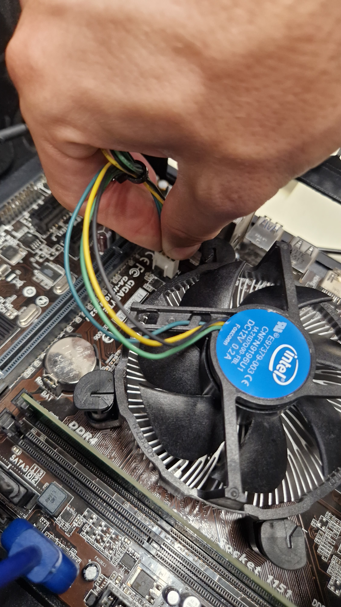

Posiciona la placa base alineant els seus ports d'E/S amb la xapa posterior del xassís, fes coincidir els forats de fixació amb els separadors metàl·lics i fixa-la cargolant el conjunt de cargols de suport sense forçar.

**2.Instal·lació de la CPU, pasta tèrmica i refrigeració:**

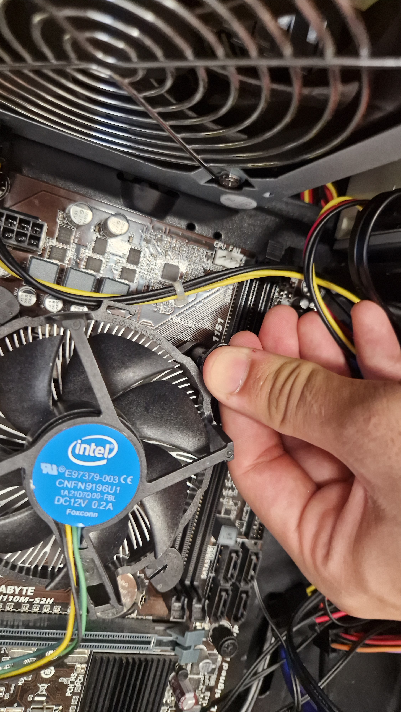 

Alinea les muesques d'orientació de la CPU amb el sòcol, diposita-la sense fer pressió, tanca la palanca de fixació, aplica una petita quantitat de pasta tèrmica nova (mida d'un pèsol) al centre del processador, col·loca el dissipador a sobre alineant els ancoratges, ajusta els cargols de fixació amb un gir de 90° i connecta el ventilador al capçal.

**3.Instal·lació dels mòduls de memòria RAM:**

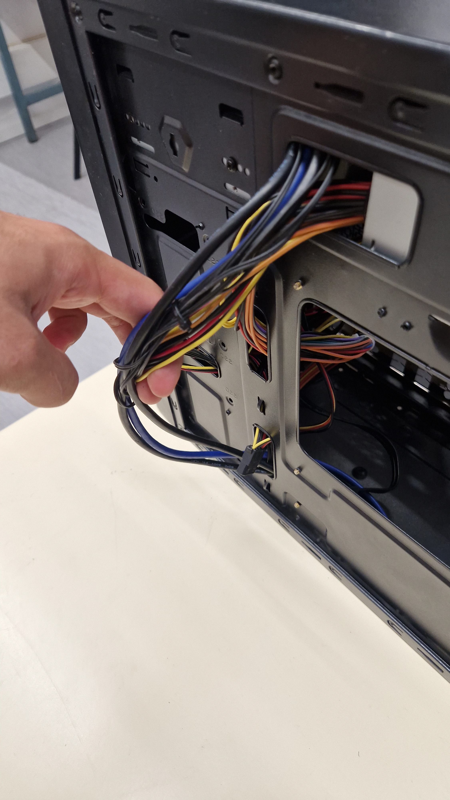

Alinea la muesca del mòdul RAM amb la pestanya de la ranura DIMM i prem fermament cap avall des de tots dos extrems fins que les pestanyes de seguretat es tanquin automàticament amb un "clic".

**4.Instal·lació de la targeta gràfica (GPU):**

Alinea el connector de la GPU amb la ranura PCIe x16, empeny cap avall fins que la pestanya de bloqueig es tanqui sola i fixa la pletina metàl·lica al xassís mitjançant els cargols corresponents.

**5.Instal·lació de la font d'alimentació i cablatge:**

Col·loca la font d'alimentació al seu allotjament, fixa-la amb els cargols a la caixa, passa els cables pel panell posterior i connecta l'alimentació principal ATX de 24 pins, la línia EPS de la CPU i l'alimentació PCIe de la targeta gràfica.

**6.Tancament del xassís i connexions finals:**

  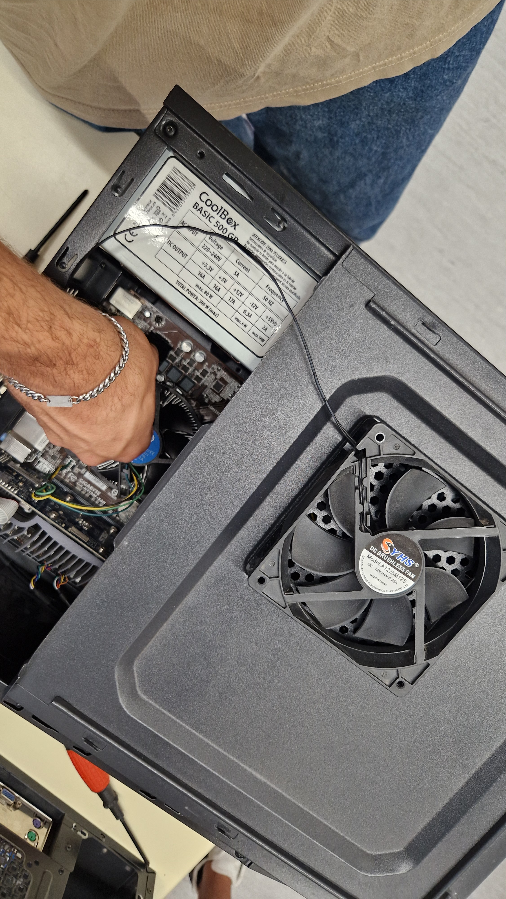

Torna a connectar el ventilador auxiliar de la caixa a la placa base, col·loca els panells laterals del xassís i enrosca els cargols de les tapes per deixar el PC completament muntat.

# Evidència 2

Per a cada apartat respon les preguntes, documenta al Gitbook amb captures els processos que realitzis i explica quin software s’ha utilitzat per a consultar la informació que es demana de l’ordinador.

**Realitza aquest apartat amb el teu ordinador portàtil.**

Aquí tens alguns suggeriments de software que pots utilitzar:

- Administrador de tasques.
- CPU-Z (https://www.cpuid.com/softwares/cpu-z.html)
- UserBenchmark (https://www.userbenchmark.com/Software)

### Mira quin processador tens i digues la litografia (busca què és), nombre de nuclis i freqüència de treball que té. Digues per a cadascun d’aquests aspectes què són i en què incideixen en el rendiment de l’ordinador.

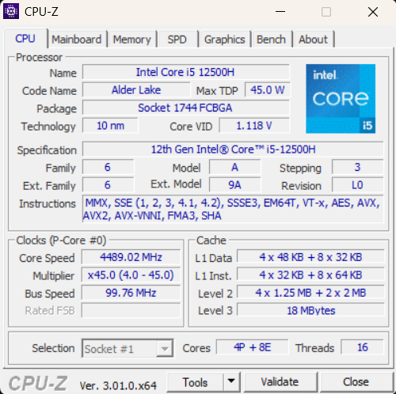

- Litografia: 10 nm
- Nombre de Nuclis: 16
- Freqüència de Treball: 4489.02 MHz      

**Litografia:** És la mida dels transistors fabricats dinsd del xip, mesurada en nanometres (nm). Quan menor sigui la litografia, més trahnsistors és poden incloure en el mateix espai. Això augmenta l'eficiència energètica, redueix la calor generada i amillora el rendiment

### Què és el benchmarking? Fes una prova de rendiment (benchmark) del processador que tens a l’ordinador. Després fes una prova de rendiment de la gràfica integrada.

- El **BenchMarking** és el procés d'executar proves entàndart del programari per mesurar el rendiment d'un component o sistema i comparar-lo amb altres

 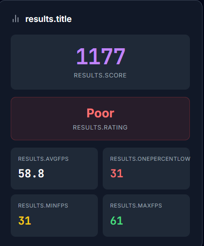

### Mostrar el consum de recursos de l’ordinador CPU, RAM, xarxa, disc, gràfica, etc. sense tenir cap programa funcionant, amb el navegador obert i amb el programa de benchmark en funcionament.

- **Cap Programa Funcionant**

 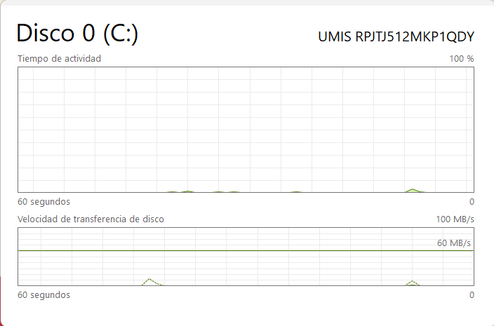

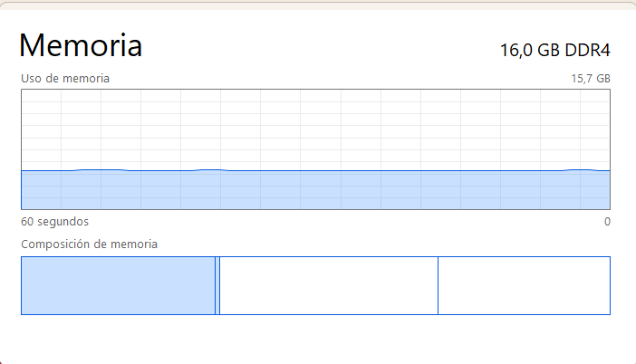 

**Navegador Obert**

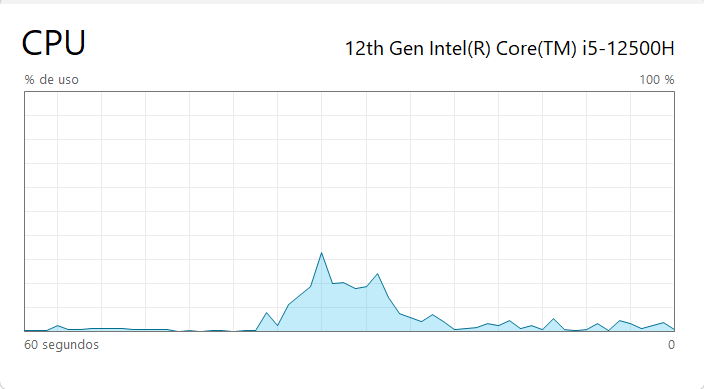 

**BenchMark actiu**

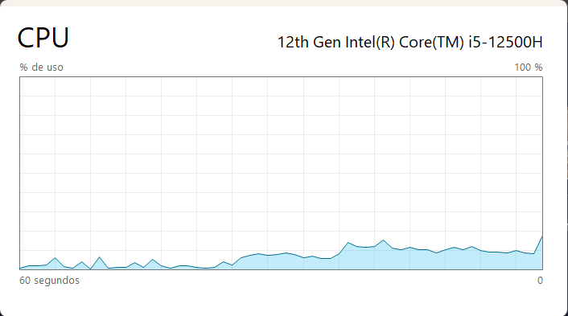 

 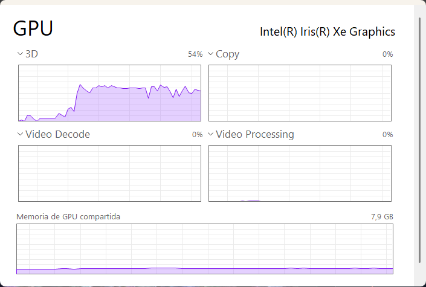

### Comprova la velocitat d’internet que tenim disponible.

### Què és la memòria cau (caché)? Comprova quin espai de caché té cada tipus de caché del teu ordinador. Cerca com visualitzar l'espai que està ocupat per la caché al teu ordinador.

La **Memòria Cau** és un tipus de memòria integrada directament al porcessador. Emmagatzema les dades i les instruccions que la CPU utilitza amb freqüència per evitar qeu les llegeixi la RAM que és més lenta

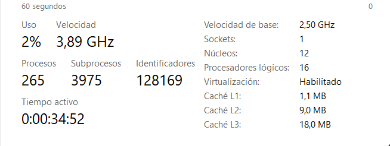 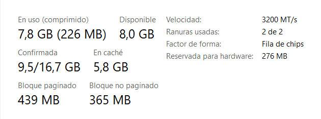 

### Què és el bus frontal de l’ordinador? Comprova la velocitat del bus frontal del nostre ordinador.

El **Bus Frontal** de l'ordinador era la linia de comunicació principal entre la CPU i el chipset de la placa base en arquitectures antigues

### Utilitza l’eina de diagnòstic del fabricant del processador.

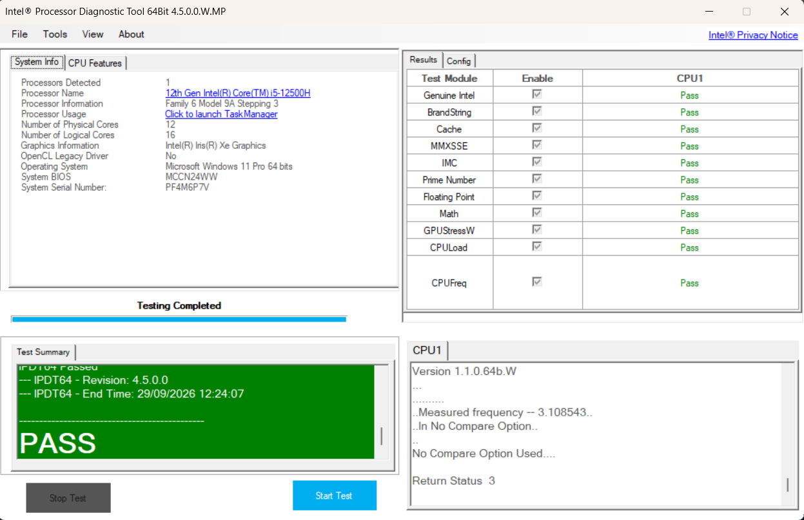

### Comprova la temperatura dels components de l’ordinador.

 
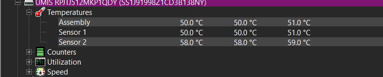 

# Evidència 3

Emplena el següent en un Google Docs per als dos casos. Cal justificar el perquè de cada requeriment (per exemple: necessita tenir tants GB de RAM perquè ...). Cerca un ordinador que compleixi aquestes característiques mínimes i intenta ajustar el preu a que sigui el més barat possible.

Investiga quines necessitats tindria en quant a components un ordinador portàtil per a fer auditories de seguretat.

Investiga i determina quines necessitats i especificacions tindria un servidor dedicat per a suportar una càrrega constant de 1.000 usuaris concurrents en un servidor web.

