# ArquitecturaPC

## 💻 Evidències — Sistemes Informàtics

> Documentació de les pràctiques de muntatge, anàlisi de maquinari i especificacions d'equips informàtics.

***

## 📑 Índex

* [🔧 Evidència 1 — Muntatge i neteja del PC](ArquitecturaPC.md#-evidència-1)
* [🖥️ Evidència 2 — Anàlisi de l'ordinador portàtil](ArquitecturaPC.md#-evidència-2)
* [🖥️ Evidència 3 — Requisits dels equips](ArquitecturaPC.md#-evidència-3)

***

## 🔧 Evidència 1

## Arquitectura PC - Fonaments de Maquinari

### Edu Gordo - CASIX 1

### 1. Preparació, obertura i neteja del xassís

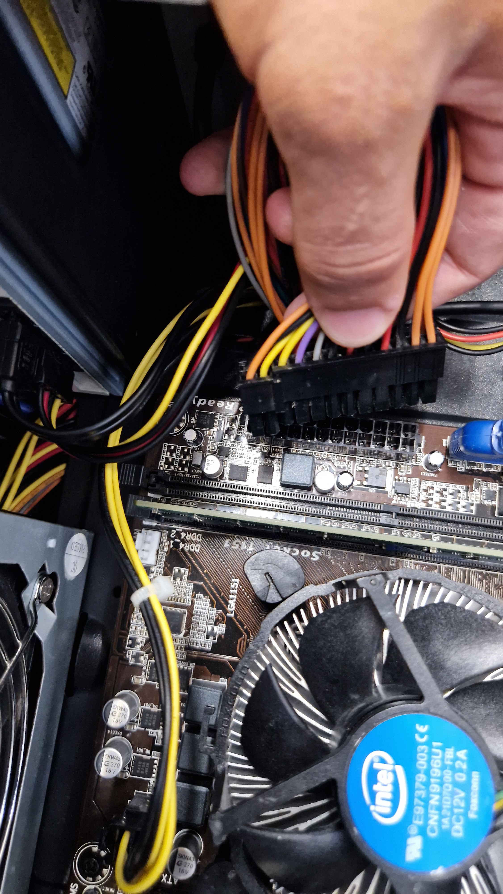

Desconnecta el PC de la xarxa elèctrica, retira els cargols dels panells laterals per extreure la tapa principal i desconnecta el ventilador auxiliar de la placa base per poder retirar la tapa posterior sense obstacles, aprofitant per retirar la pols acumulada al xassís i a les aspes del ventilador amb un pinzell suau o un drap de microfibra lleugerament humit.

### 2. Extracció i neteja de la targeta gràfica (GPU)

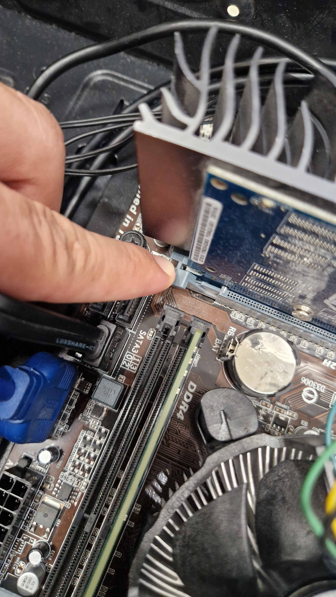 

Desconnecta l'alimentació PCIe si en té, desbloqueja la pestanya de seguretat de la ranura PCIe x16 i extreu la targeta gràfica lliscant-la cap amunt de manera vertical, passant després a netejar la pols acumulada al dissipador i aspes amb aire comprimit, a més de repassar la placa de circuit (PCB) amb un pinzell antiestàtic i netejar els seus contactes daurats utilitzant un cotó impregnat en alcohol isopropílic (99%).

### 3. Extracció i neteja dels mòduls de memòria RAM

 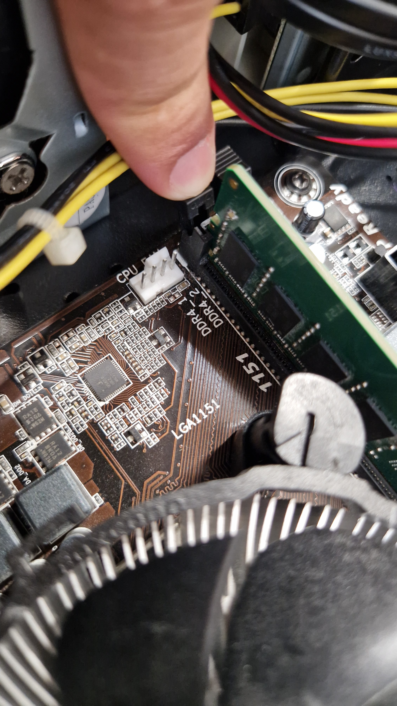

Obre les pestanyes de fixació dels extrems de les ranures DIMM i estira els mòduls cap amunt en línia recta per extreure'ls, aprofitant per netejar la superfície de la targeta amb un pinzell suau i fregar els contactes daurats amb alcohol isopropílic o una goma d'esborrar neta per eliminar qualsevol residu que pugui afectar la connexió.

### 4. Retirada i neteja del sistema de refrigeració de la CPU

 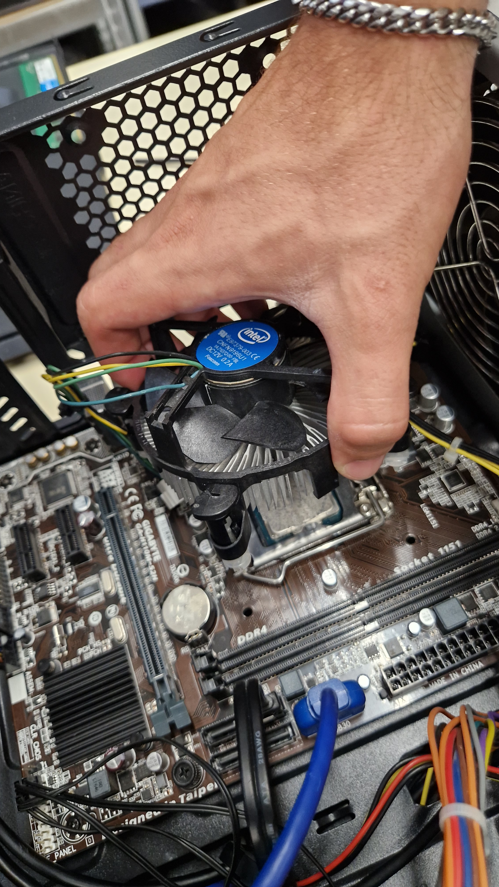 

Desconnecta el cable d'alimentació del ventilador de la CPU (capçal CPU\_FAN), desferma el mecanisme de fixació (sigui per pressió o cargols amb gir de 90°) i retira el conjunt de dissipador i ventilador amb cura de no forçar el processador, aplicant aire comprimit entre les aletes de refrigeració per expulsar la pols i retirant la pasta tèrmica petrificada de la seva base amb un paper suau o drap de microfibra xopat en alcohol isopropílic.

### 5. Extracció i neteja del processador (CPU)

Obre la palanca de fixació del sòcol (socket), aixeca la coberta protectora i extreu el processador agafant-lo pels extrems laterals sense tocar els pins o contactes inferiors, per després retirar acuradament totes les restes de pasta tèrmica antiga de la seva superfície metàl·lica (IHS) utilitzant un drap que no deixi residus impregnat amb alcohol isopropílic fins que quedi completament net.

### 6. Extracció i neteja de la font d'alimentació (PSU)

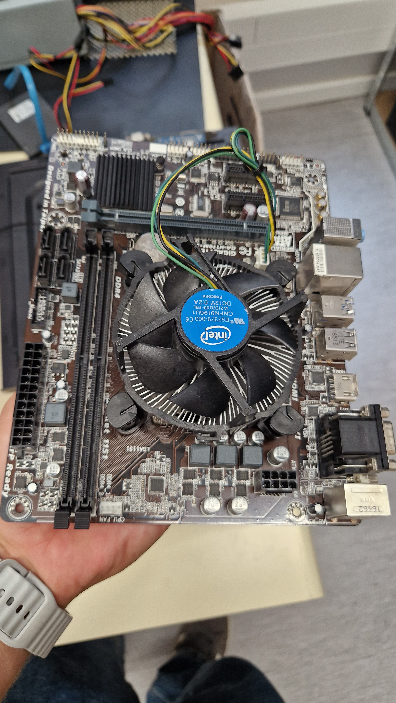  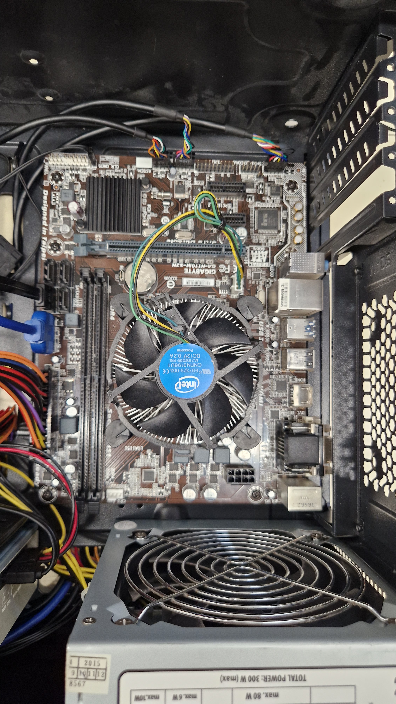

Retira el panell posterior del xassís per accedir a l'encaminament de cables (cable management), desconnecta el connector principal ATX de 24 pins juntament amb la resta del cablatge, descaragola la font de la caixa per extreure-la i aplica ràfegues curtes d'aire comprimit a través de les seves grelles exteriors per expulsar la pols acumulada al seu interior.

### 7. Extracció i neteja de la placa base

 

Desconnecta tots els cables restants del panell frontal i SATA, retira els cargols que fixen la placa base als separadors (standoffs) de la caixa per poder extreure-la amb cura, i aprofita per netejar la seva superfície, el panell de connexions I/O posterior i l'interior de les ranures PCIe i DIMM utilitzant un pinzell antiestàtic i aire comprimit a una distància de seguretat.

### 8. Instal·lació de la placa base

Posiciona la placa base alineant els seus ports d'E/S amb la xapa posterior del xassís, fes coincidir els forats de fixació amb els separadors metàl·lics i fixa-la cargolant el conjunt de cargols de suport sense forçar.

### 9. Instal·lació de la CPU, pasta tèrmica i refrigeració

 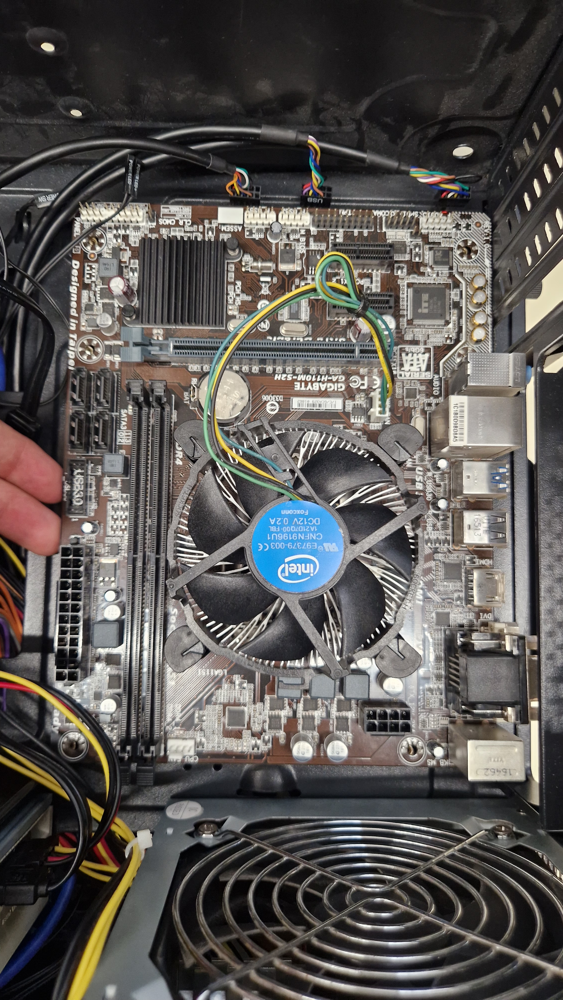

Alinea les muesques d'orientació de la CPU amb el sòcol, diposita-la sense fer pressió, tanca la palanca de fixació, aplica una petita quantitat de pasta tèrmica nova (mida d'un pèsol) al centre del processador, col·loca el dissipador a sobre alineant els ancoratges, ajusta els cargols de fixació amb un gir de 90° i connecta el ventilador al capçal.

### 10. Instal·lació dels mòduls de memòria RAM

Alinea la muesca del mòdul RAM amb la pestanya de la ranura DIMM i prem fermament cap avall des de tots dos extrems fins que les pestanyes de seguretat es tanquin automàticament amb un "clic".

### 11. Instal·lació de la targeta gràfica (GPU)

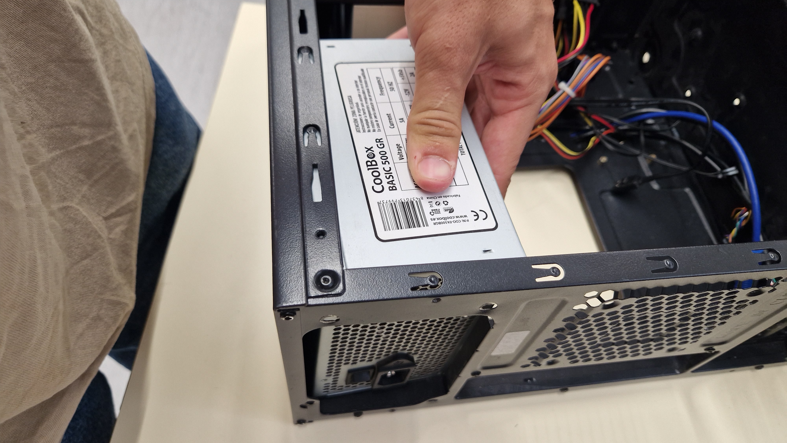

Alinea el connector de la GPU amb la ranura PCIe x16, empeny cap avall fins que la pestanya de bloqueig es tanqui sola i fixa la pletina metàl·lica al xassís mitjançant els cargols corresponents.

### 12. Instal·lació de la font d'alimentació i cablatge

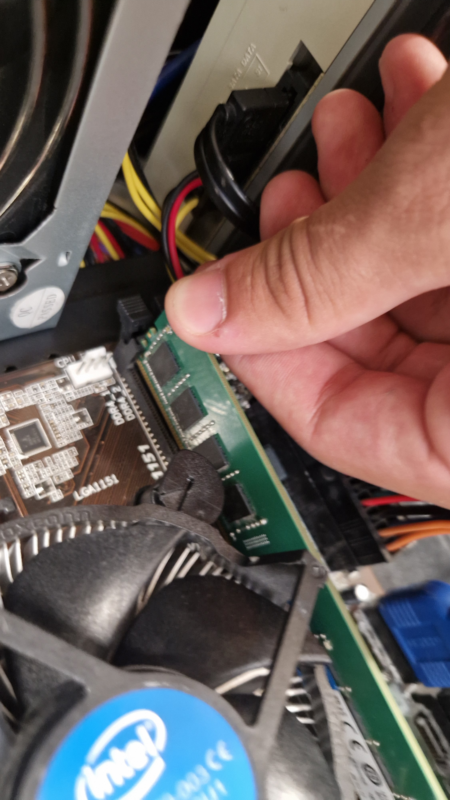

Col·loca la font d'alimentació al seu allotjament, fixa-la amb els cargols a la caixa, passa els cables pel panell posterior i connecta l'alimentació principal ATX de 24 pins, la línia EPS de la CPU i l'alimentació PCIe de la targeta gràfica.

### 13. Tancament del xassís i connexions finals

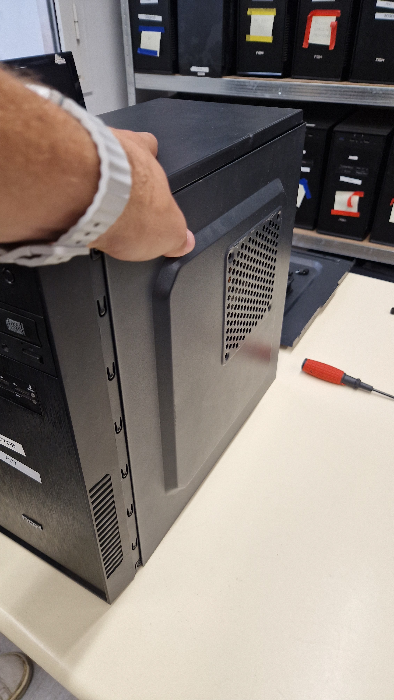 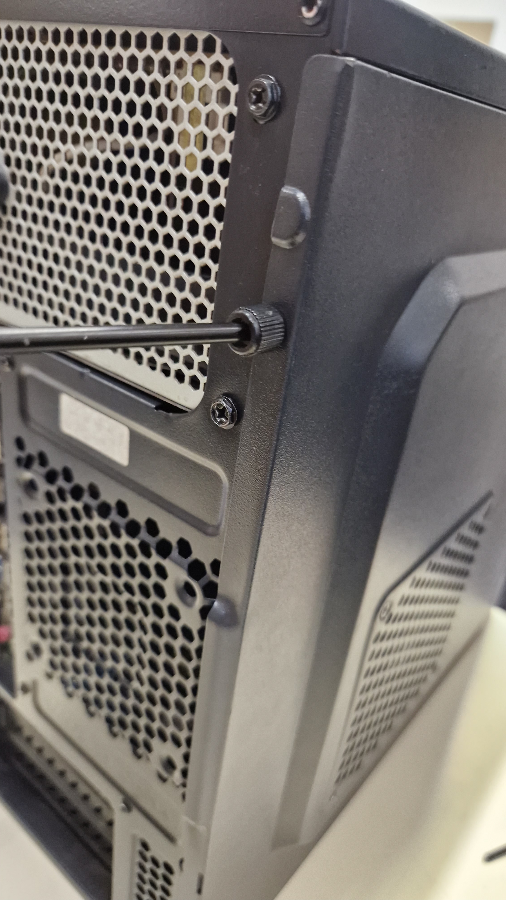 

Torna a connectar el ventilador auxiliar de la caixa a la placa base, col·loca els panells laterals del xassís i enrosca els cargols de les tapes per deixar el PC completament muntat.

***

## 🖥️ Evidència 2

### Per a cada apartat respon les preguntes

Documenta al Gitbook amb captures els processos que realitzis i explica quin software s’ha utilitzat per a consultar la informació que es demana de l’ordinador.

**Realitza aquest apartat amb el teu ordinador portàtil.**

#### Software utilitzat

* Administrador de tasques.
* CPU-Z: https://www.cpuid.com/softwares/cpu-z.html
* UserBenchmark: https://www.userbenchmark.com/Software

### 1. Processador

#### Característiques

* **Litografia:** 10 nm
* **Nombre de nuclis:** 16
* **Freqüència de treball:** 4489.02 MHz

#### Litografia

És la mida dels transistors fabricats dins del xip, mesurada en nanòmetres (nm). Quan menor sigui la litografia, més transistors es poden incloure en el mateix espai. Això augmenta l'eficiència energètica, redueix la calor generada i millora el rendiment.

### 2. Benchmarking

El **Benchmarking** és el procés d'executar proves estàndard del programari per mesurar el rendiment d'un component o sistema i comparar-lo amb altres.

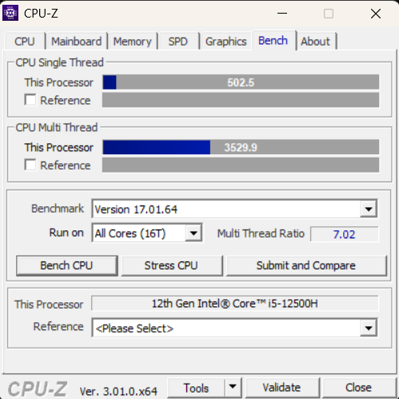 

### 3. Consum de recursos

#### Cap programa funcionant

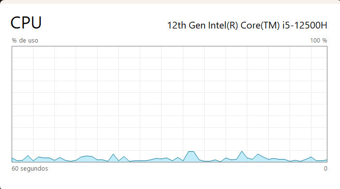 

 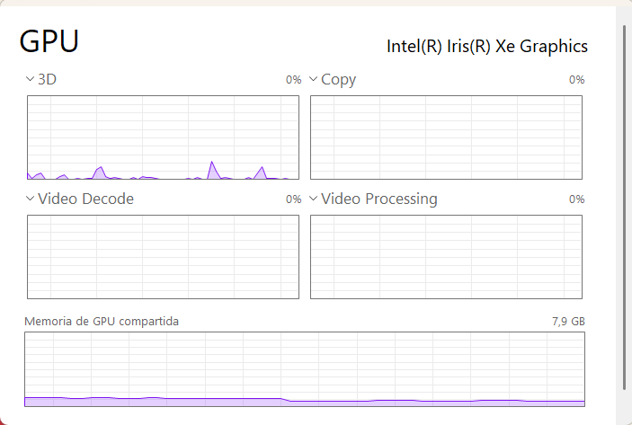

#### Navegador obert

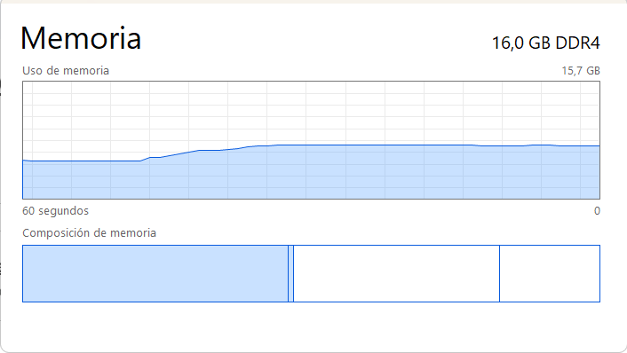 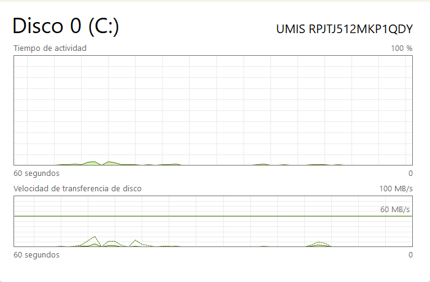

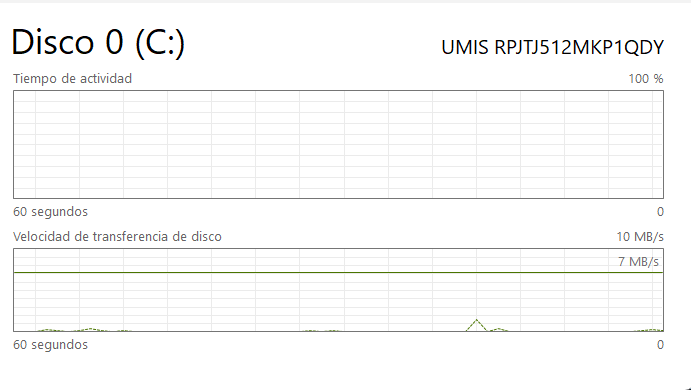 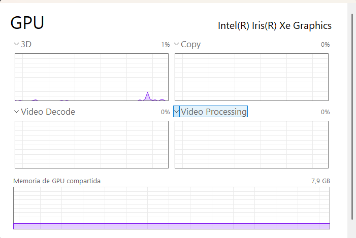

#### Benchmark actiu

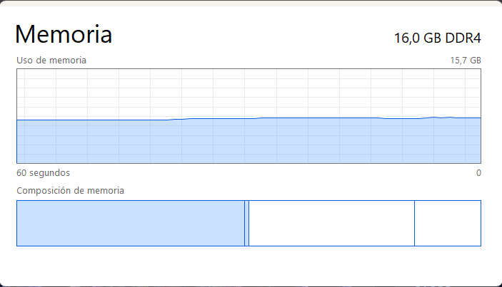 

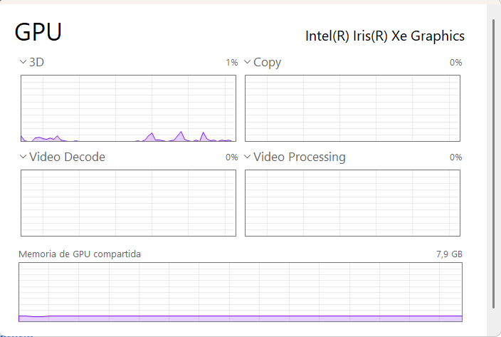 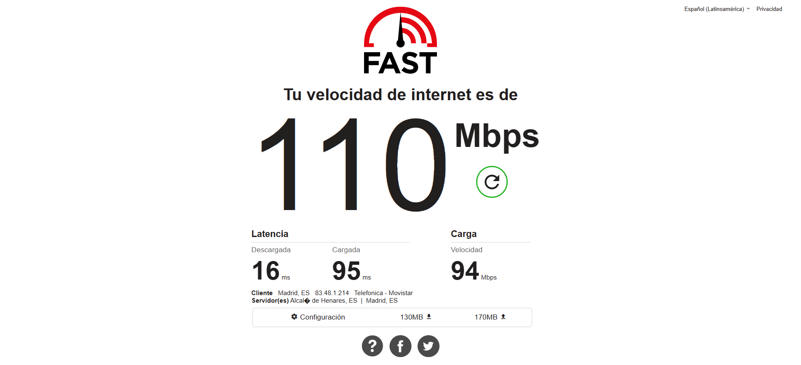

### 4. Velocitat d'Internet

### 5. Memòria cau (caché)

La **Memòria Cau** és un tipus de memòria integrada directament al processador. Emmagatzema les dades i les instruccions que la CPU utilitza amb freqüència per evitar que les llegeixi la RAM, que és més lenta.

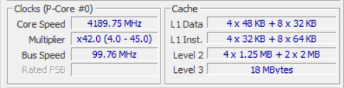 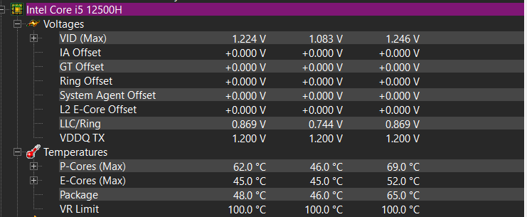

### 6. Bus frontal

El **Bus Frontal** de l'ordinador era la línia de comunicació principal entre la CPU i el chipset de la placa base en arquitectures antigues.

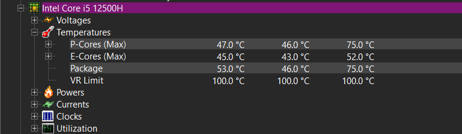

### 7. Eina de diagnòstic del fabricant

### 8. Temperatura dels components

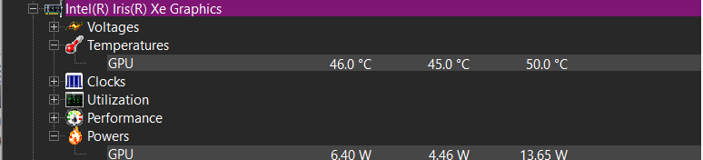

&#x20;

&#x20;

***

## 🖥️ Evidència 3

### Requisits dels equips

Emplena el següent en un Google Docs per als dos casos. Cal justificar el perquè de cada requeriment. Cerca un ordinador que compleixi aquestes característiques mínimes i intenta ajustar el preu perquè sigui el més barat possible.

### 🔐 1. Ordinador portàtil per a auditories de seguretat

#### Processador

**Intel Core i7**

**Justificació:** En auditories de seguretat és imprescindible utilitzar hipervisors per executar simultàniament el sistema operatiu principal i diverses màquines virtuals. Per això es necessita un processador que disposi de mínim 8 nuclis i 16 fils.

#### Memòria RAM

**16 GB DDR4/DDR5**

**Justificació:** Les màquines virtuals necessiten el seu propi espai de RAM assignat per poder funcionar correctament. Si sumem tot el funcionament de les màquines i també comptem amb el propi sistema operatiu amfitrió, 8 GB de RAM es queden curts.

#### Emmagatzematge

**512 GB - 1 TB SSD NVMe M.2**

**Justificació:** Una màquina virtual, normalment, com a predeterminat, ocupa entre 15 i 40 GB d'espai en el disc, pel que, en el cas que se'n necessitessin diverses, l'espai ocupat al disc seria massa perquè pogués funcionar l'ordinador amb total rendiment.

#### Targeta de xarxa

**Wi-Fi compatible amb Mode Monitor**

**Justificació:** Per poder funcionar amb xarxes inal·làmbriques, el xip de xarxa ha de permetre posar la interfície en mode monitor. Si la targeta no és compatible, caldrà una USB externa.

#### Targeta gràfica

**Integrada (Intel Iris) / Dedicada (NVIDIA RTX)**

**Justificació:** S'utilitza normalment per la descodificació i atac de hashes de contrasenyes. La GPU és capaç de provar milions de combinacions per segon, tasca on la CPU és extremadament lenta.

#### Connectivitat

**Ethernet RJ-45 i USB 3.2**

**Justificació:** El port Ethernet permet connectar-se directament a la xarxa d'un client per dur a terme auditories internes. Els ports USB són necessaris per connectar antenes Wi-Fi addicionals, eines de hardware com discs durs o sistemes operatius booteables.

***

### 🌐 2. Servidor dedicat — 1.000 usuaris concurrents

#### Processador (CPU)

**Mínim 16 a 24 nuclis amb 32 a 48 fils**

**Justificació:** Cada connexió simultània requereix capacitat de processament paral·lel. Aquest volum de nuclis evita que el servidor es col·lapsi i manté els temps de resposta baixos.

#### Memòria RAM

**Mínim 64 GB a 128 GB RAM ECC**

**Justificació:** Les 1.000 sessions actives i la base de dades consumeixen directament desenes de gigabytes de RAM. La memòria restant s'utilitza per a la memòria cau, mentre que la tecnologia ECC evita caigudes del sistema corregint errors de memòria en temps real.

#### Emmagatzematge

**2x SSD NVMe Enterprise de 960 GB en RAID 1**

**Justificació:** Els SSD de classe Enterprise suporten un alt volum d'operacions per segon (IOPS) sense degradar-se. La configuració en RAID 1 garanteix que el servidor continuï funcionant si falla un dels discs.

#### Ample de banda i xarxa

**Port dedicat de 1 Gbps**

**Justificació:** Evita el col·lapse de la interfície de xarxa davant els pics de tràfic que generen 1.000 usuaris descarregant informació alhora.

#### Font d'alimentació redundant

**2x PSU**

**Justificació:** Garanteix el funcionament continuat del servidor si es produeix una fallada en una de les fonts o en la línia elèctrica.
