# Seguretat en l'Arrencada
## Fonaments de Maquinàri | Edu Gordo Cebrià | CASIX 1

# 📋 Evidències

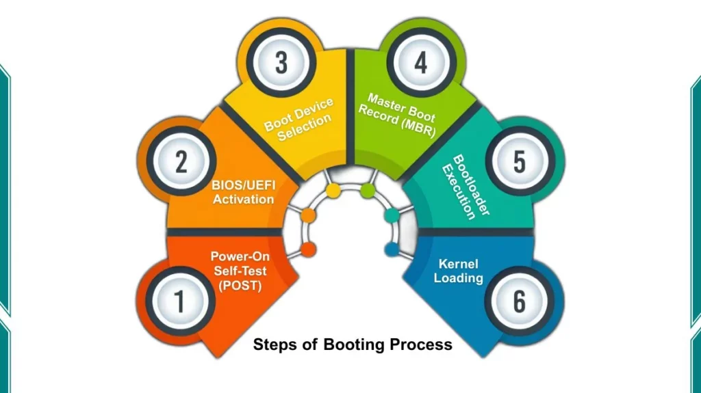
## - Fes un esquema de l'ordre d'arrencada amb BIOS/UEFI sense TPM i amb TPM.

## - Fes un esquema de l'ordre d'arrencada amb BIOS/UEFI sense TPM i amb TPM

## Esquema de l'ordre d'arrencada amb BIOS/UEFI sense TPM i amb TPM

<table>
<tr>
<td width="50%" valign="top">

### Sense TPM

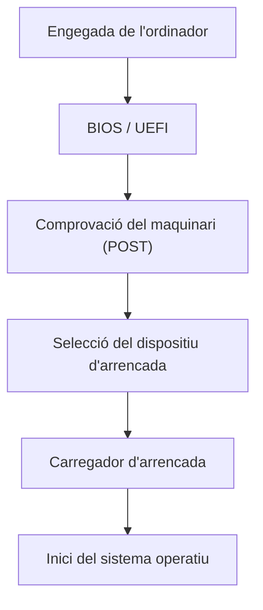

</td>
<td width="50%" valign="top">

### Amb TPM

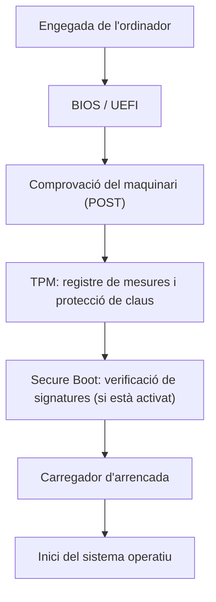

</td>
</tr>
</table>

## - Fes fotos de les diferents parts del procés d'arrencada al teu ordinador (que no tingui TPM, és a dir, el del taller) i explica en què consisteix cada part:
###  1. En el cas de MBR, cal explicar en què es diferencia de GPT.
###  2. Comprova si el teu ordinador portàtil té UEFI o BIOS i fes el mateix amb l'ordinador del taller que tens assignat.

---

# ⚙️ Configuració de BIOS/UEFI

## Entra a la BIOS/UEFI i localitza amb fotografies:

### - Data i hora.

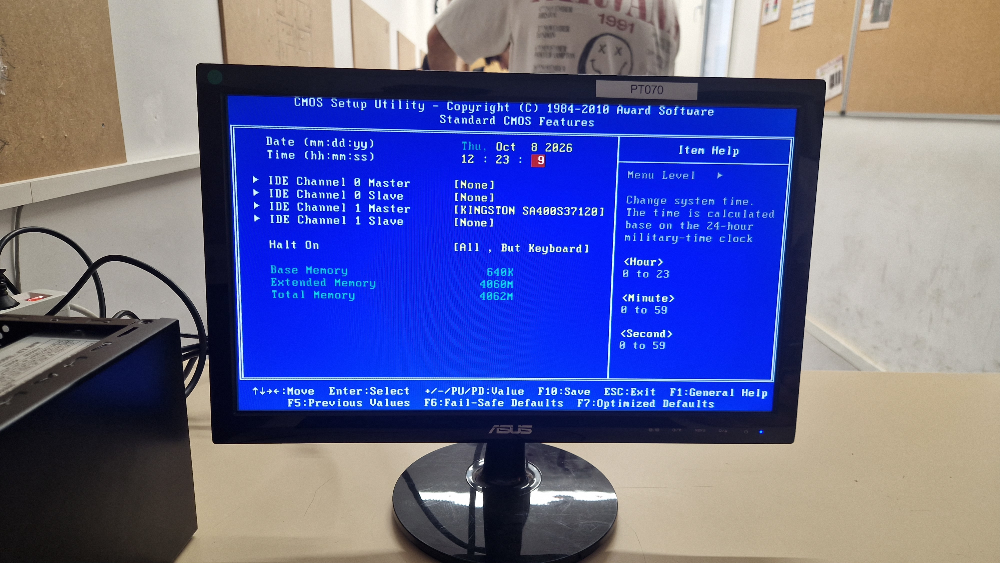

- Boot Order.

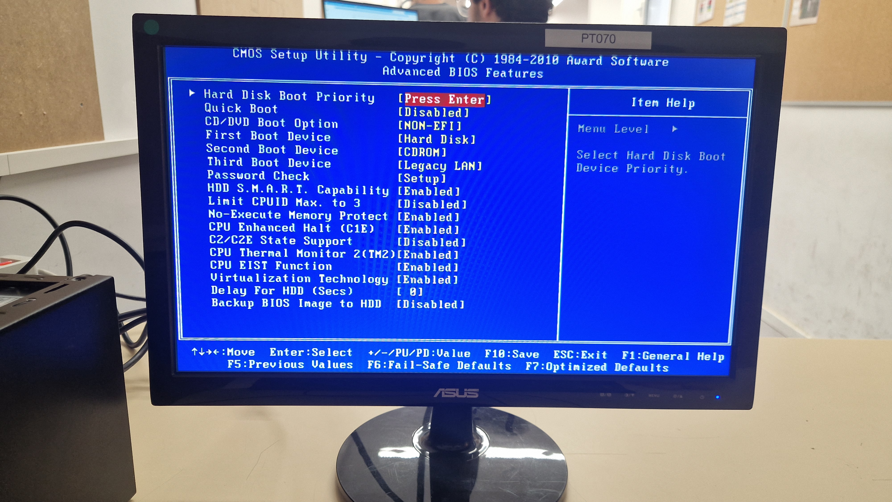
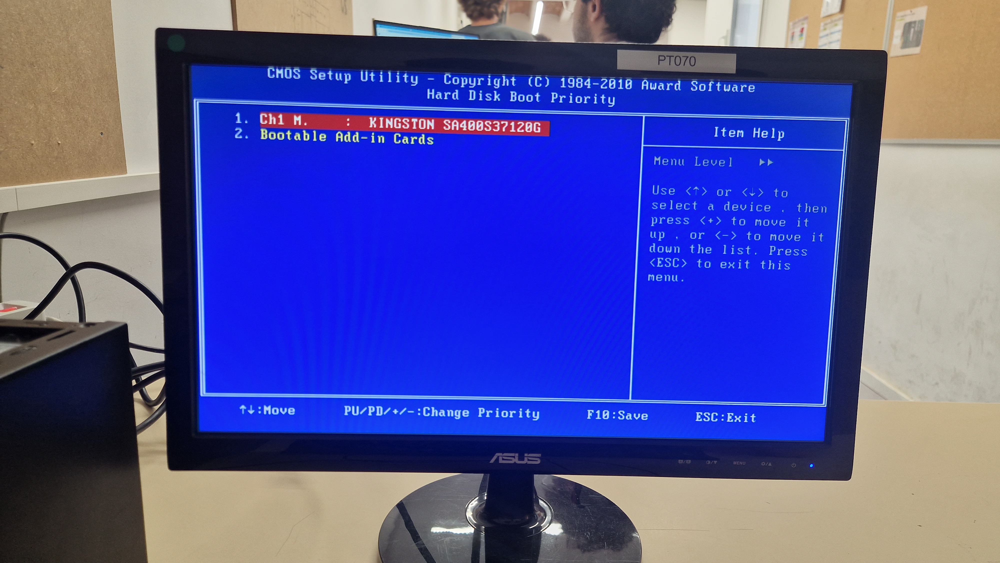

### - Virtualització.

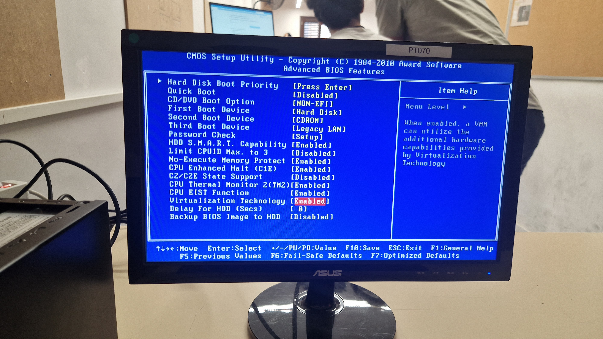

### - Contrasenya de BIOS/UEFI.

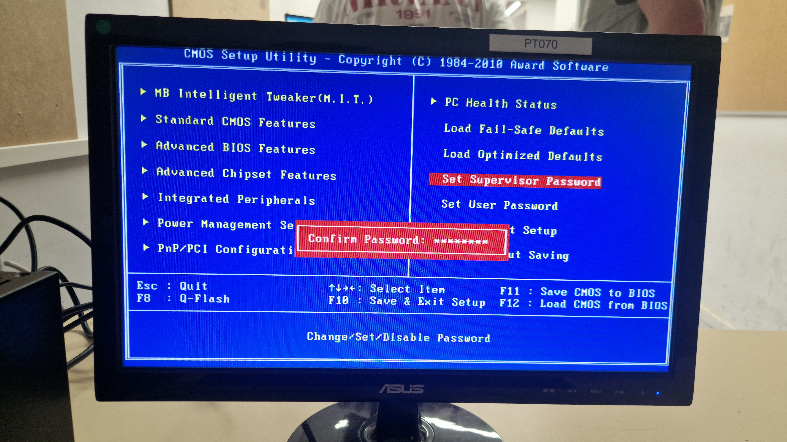

### - TPM (UEFI): Intel Platform Trust Technology als portàtils. Tingues en compte que els PC de sobretaula del taller no tenen TPM.

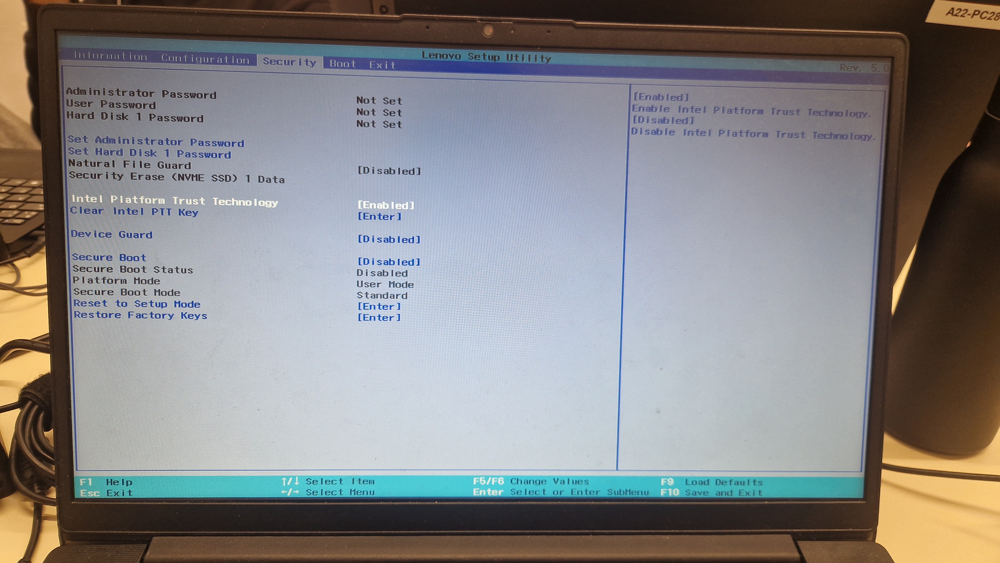

### - Secure Boot (UEFI).

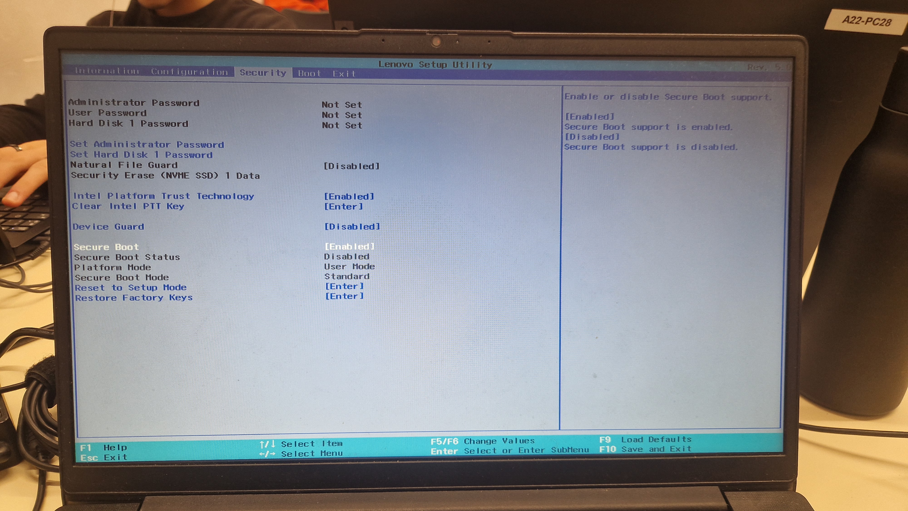

### - IOMMU (estarà sota el nom Intel: Intel VT-d, *Virtualization Technology for Directed I/O*).

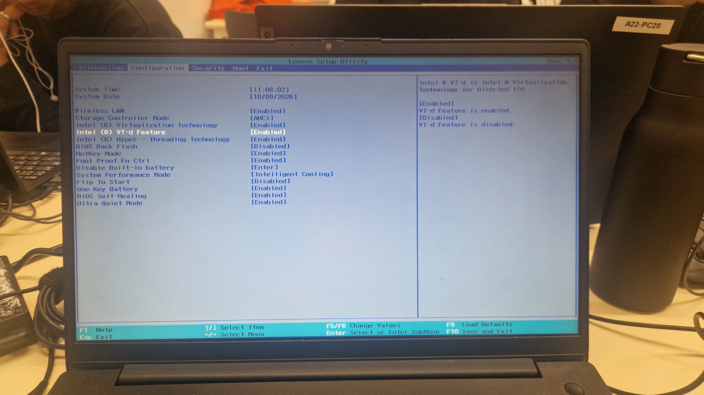

- Hyper-Threading.

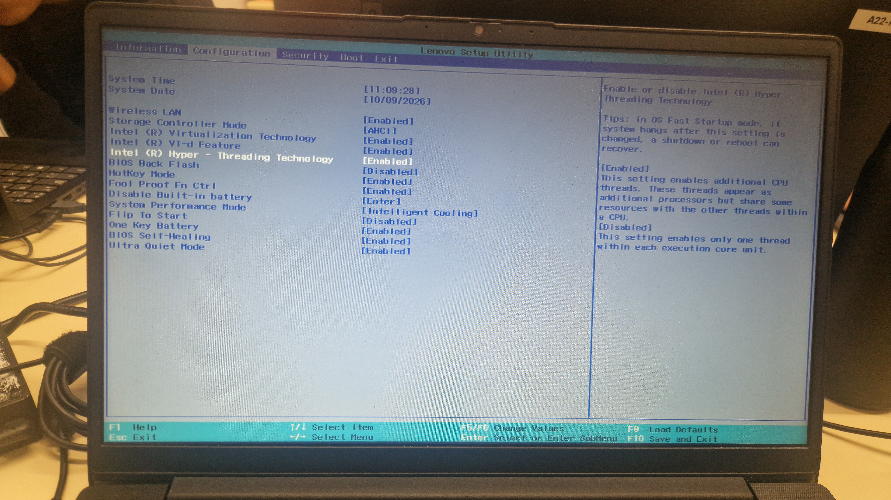
