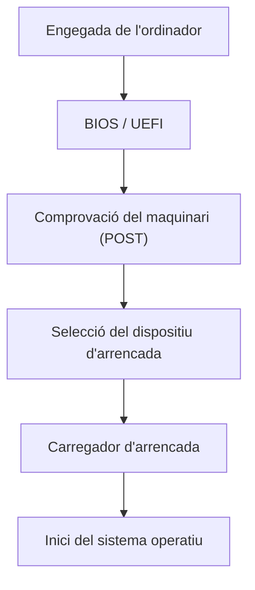
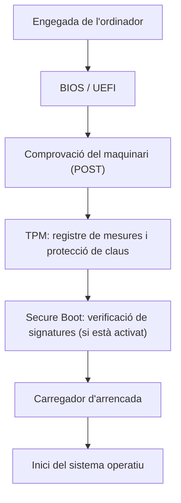

# Seguretat en l'Arrencada
## Fonaments de Maquinàri | Edu Gordo Cebrià | CASIX 1

# 📋 Evidències

## - Fes un esquema de l'ordre d'arrencada amb BIOS/UEFI sense TPM i amb TPM.

## Esquema de l'ordre d'arrencada amb BIOS/UEFI sense TPM i amb TPM

<table>
<tr>
<td width="50%" valign="top">

### Sense TPM

</td>
<td width="50%" valign="top">

### Amb TPM

</td>
</tr>
</table>

## - Fes fotos de les diferents parts del procés d'arrencada al teu ordinador (que no tingui TPM, és a dir, el del taller) i explica en què consisteix cada part:
### 1. En el cas de MBR, cal explicar en què es diferencia de GPT

MBR i GPT són dos sistemes per organitzar les particions d'un disc dur o SSD.

| Característica | MBR | GPT |
|---|---|---|
| Capacitat màxima habitual | 2 TB | Entre 30 i 40 TB --> 9400M TB (limit Real) |
| Nombre de particions | Fins a 4 particions primàries | Fins a 128 particions a Windows |
| Compatibilitat | BIOS tradicional | UEFI |
| Seguretat de les dades | Una còpia principal de la taula de particions | Còpies de la taula de particions i comprovacions CRC |
| Ús actual | Equips antics | Equips moderns |

MBR és un sistema més antic, amb limitacions de capacitat i de nombre de particions. GPT és més modern, permet utilitzar discos de més de 2 TB i ofereix més protecció davant la corrupció de la informació de les particions. Per això, GPT és l'opció habitual en ordinadors moderns amb UEFI.

###  2. Comprova si el teu ordinador portàtil té UEFI o BIOS i fes el mateix amb l'ordinador del taller que tens assignat.

---

# ⚙️ Configuració de BIOS/UEFI

## Entra a la BIOS/UEFI i localitza amb fotografies:

### - Data i hora.

- Boot Order.

### - Virtualització.

### - Contrasenya de BIOS/UEFI.

### - TPM (UEFI): Intel Platform Trust Technology als portàtils. Tingues en compte que els PC de sobretaula del taller no tenen TPM.

### - Secure Boot (UEFI).

### - IOMMU (estarà sota el nom Intel: Intel VT-d, *Virtualization Technology for Directed I/O*).

- Hyper-Threading.

