# IMPLANTACIÓ D'APLICACIONS WEB - DESPLEGAMENT DE L'ENTORN AÏLLAT DE CONTENCIÓ
## EDU GORDO CEBRIÀ | CASIX 26 - 27

# Índex

### 1. [Evidència 1: Desplegament d'entorn aïllat](#evidència-1-desplegament-dentorn-aïllat)
### 2. [Evidència 2: Desplegament Express de la Pila LAMP](#evidència-2-desplegament-express-de-la-pila-lamp)
### 3. [Evidència 3: Registre Automàtic d'IP i Auditoria d'Accés](#evidència-3-registre-automàtic-dip-i-auditoria-daccés)

## Evidència 1: Desplegament d'entorn aïllat

- **Aïllament de xarxa:** Canviar l'adaptador de xarxa de la VM Servidor i la VM Víctima a Xarxa Interna o Només-Anfitrió (Host-Only).

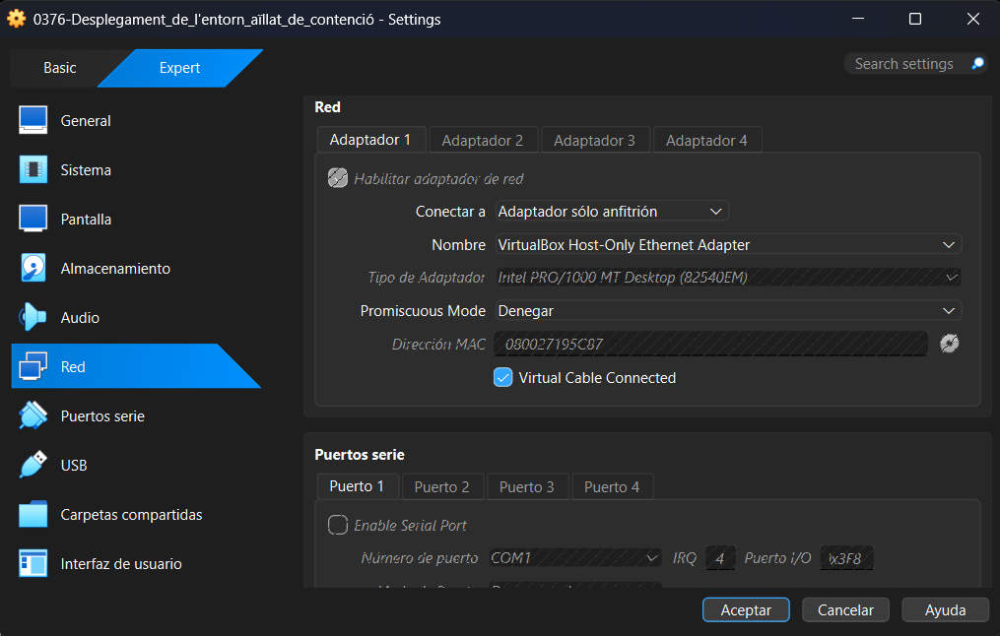 
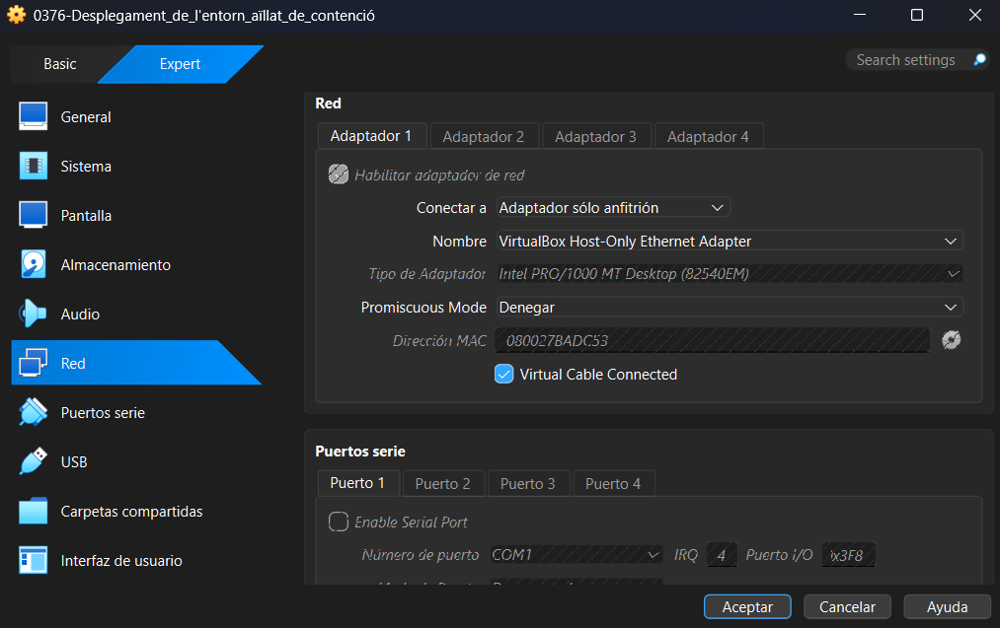

### Verificació de seguretat:

- Executar ``ping 8.8.8.8`` des de la màquina víctima i comprovar que falla (sense eixida ni accés a Internet).

- Executar ``ping [IP_del_Servidor]`` i comprovar qoue respon (comunicació interna correcta entre les VMs).

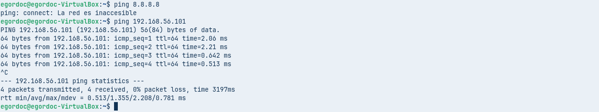

- **Congelació ("Estat Zero"):** Crear la primera instantània (snapshot) de la màquina víctima amb el nom Estado_Cero_Limpio.

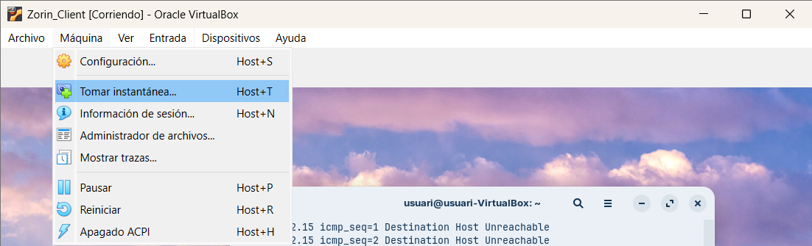
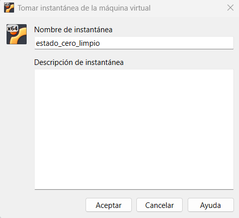

- **Simulacre de fallada:** Modifica o esborra un fitxer de sistema a la VM Víctima per simular un desastre, fallada de configuració o infecció per programari maliciós.

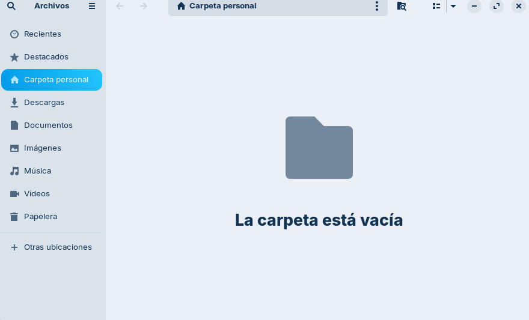

- **Prova de restauració:** Aplicar la instantània *Estado_Cero_Limpio* i comprovar que la VM torna al seu estat funcional original en menys de 2 minuts.

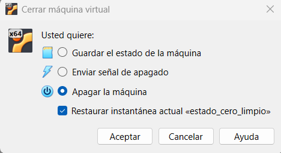

- **Checklist de sortida:** Validació en parelles per comprovar que la xarxa es manté aïllada, el servidor respon correctament i la instantània s'ha executat sense errors.

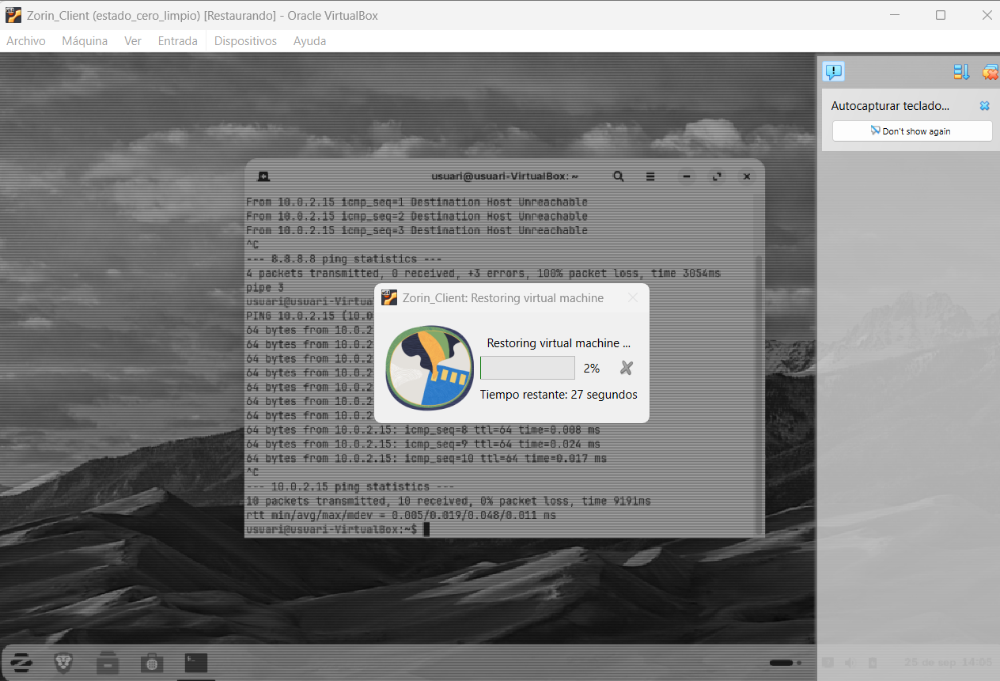
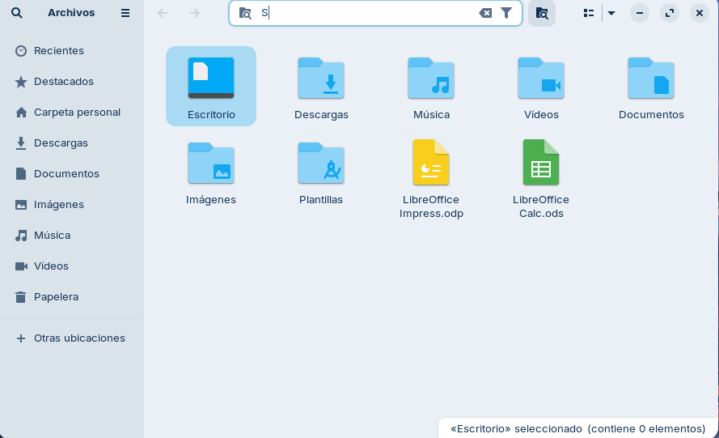
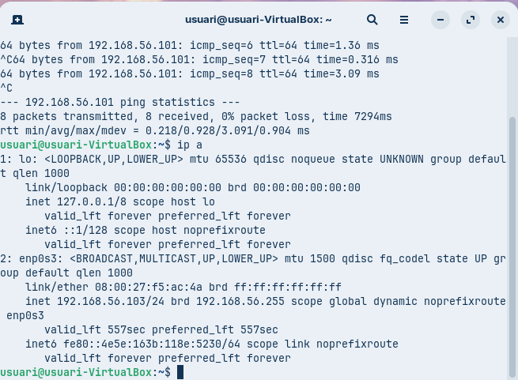
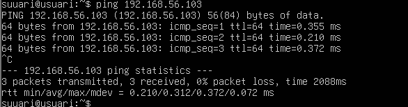

## Evidència 2: Desplegament Express de la Pila LAMP 

- **Instal·lació del programari:** Executar la comanda d'instal·lació a la terminal de la VM Servidor: 
```
sudo apt update && sudo apt install apache2 mariadb-server php php-mysql -y
```

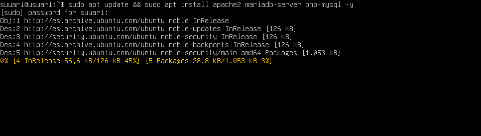

- **Comprovació de serveis:** Verificar que Apache i MariaDB estan actius mitjançant systemctl status apache2

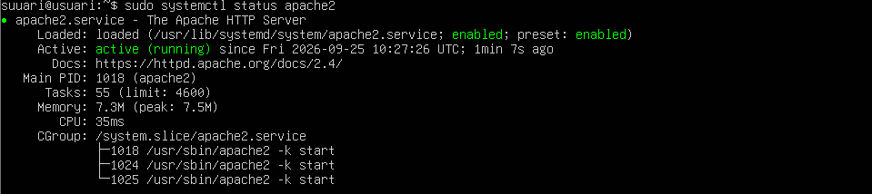
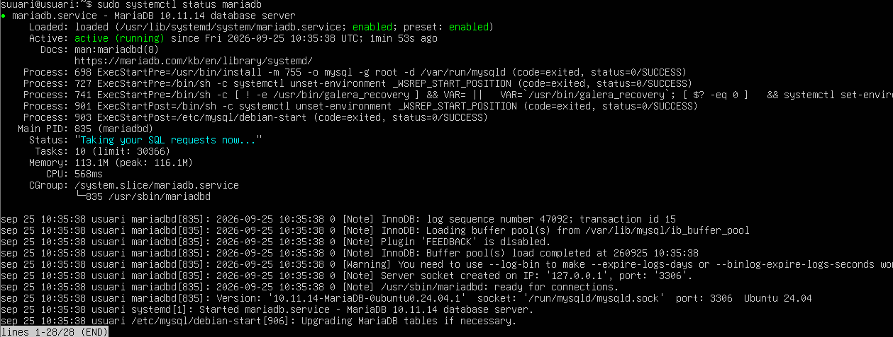

- **Creació de la base de dades d'auditoria:** Executar les instruccions per crear la BD lab_db i la taula de registres:

```
CREATE DATABASE lab_db;

CREATE TABLE lab_db.registres (

    id INT AUTO_INCREMENT PRIMARY KEY, 

    ip VARCHAR(45), 

    data TIMESTAMP DEFAULT CURRENT_TIMESTAMP, 

    detalle TEXT

);
```
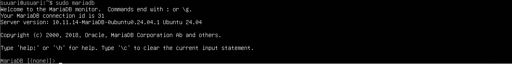
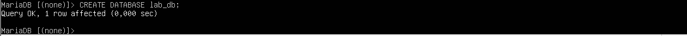
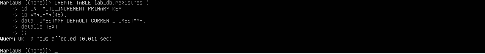
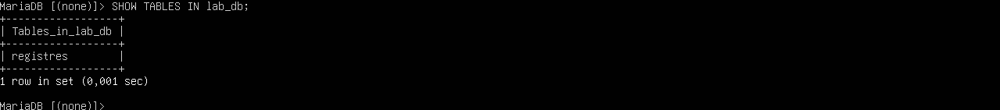


- **Verificació HTTP:** Obrir el navegador web a la VM Víctima i introduir la IP del servidor per confirmar la càrrega de la pàgina per defecte d'Apache ("It works!").

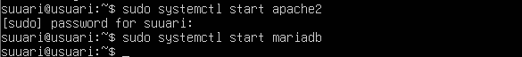
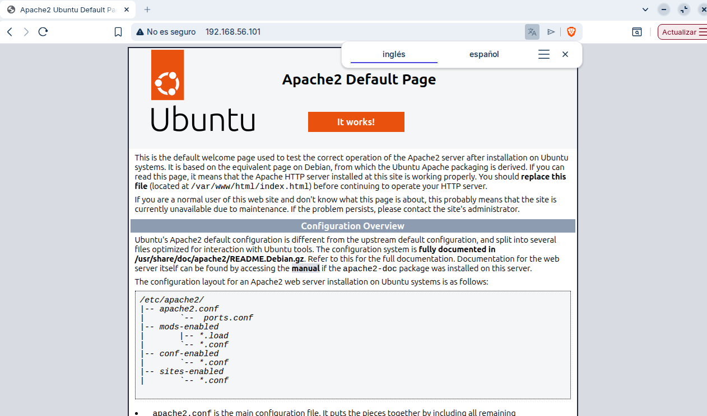

## Evidència 3: Registre Automàtic d'IP i Auditoria d'Accés

Aquesta pràctica connecta el servidor web Apache i la base de dades MariaDB mitjançant un script PHP per capturar la IP de qualsevol client que visiti el servidor i desar-la com a evidència d'auditoria.


### Pas 1: Creació de l'script PHP de captura

Al servidor LAMP, cal substituir el fitxer d'inici per defecte d'Apache per un fitxer PHP dinàmic.

- Executar la comanda per editar el fitxer principal del servidor web:
```
sudo nano /var/www/html/index.php
```

- Inserir el següent codi PHP i desar el fitxer (Ctrl + O, Enter, Ctrl + X).

```
<?php

$host = "localhost";

$user = "root";

$pass = ""; // Deixar buit si s'entra com a root localment o afegir la contrasenya de MariaDB

$db   = "lab_db";


// Connectar amb la base de dades

$conn = new mysqli($host, $user, $pass, $db);


if ($conn->connect_error) {

    die("Error de connexió: " . $conn->connect_error);

}


// Capturar la IP del visitant

$ip_visitant = $_SERVER['REMOTE_ADDR'];

$detall = "Accés detectat a la pàgina principal";


// Inserir el registre d'auditoria

$sql = "INSERT INTO registres (ip, detalle) VALUES ('$ip_visitant', '$detall')";

$conn->query($sql);


$conn->close();

?>


<!DOCTYPE html>

<html lang="ca">

<head>

    <meta charset="UTF-8">

    <title>Servidor del Laboratori</title>

</head>

<body>

    <h1>Benvingut al Servidor d'Auditoria</h1>

    <p>La teva adreça IP ha estat registrada correctament al sistema de seguretat.</p>

</body>

</html>
```

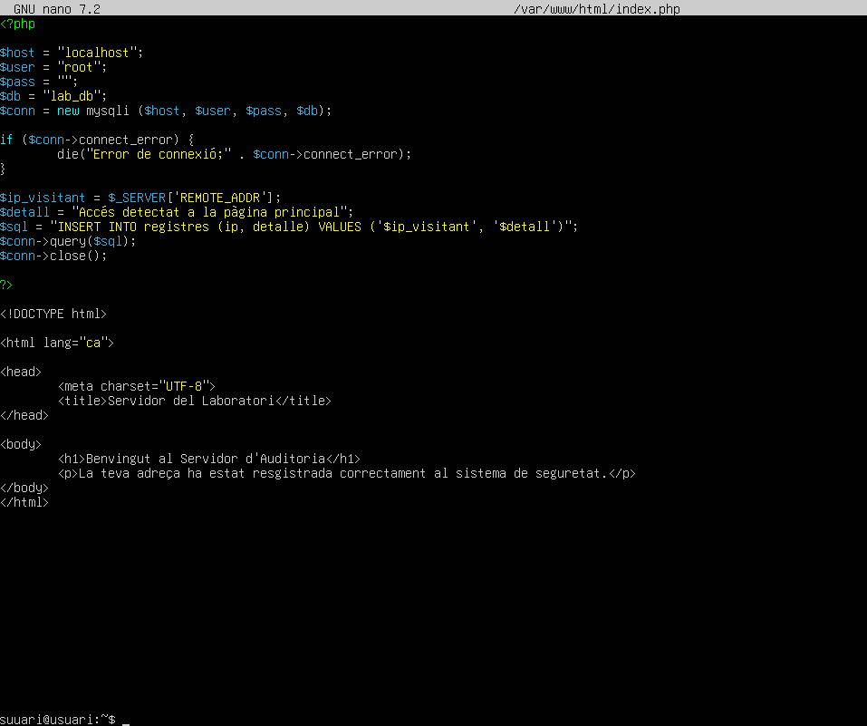

- Eliminar el fitxer per defecte d'Apache per evitar conflictes: 

```
sudo rm /var/www/html/index.html
```


### Pas 2: Configuració de permisos del directori web

- Assignar la propietat del directori a l'usuari d'Apache (www-data) per assegurar-ne la correcta execució:

```
sudo chown -R www-data:www-data /var/www/html/
```

```
sudo chmod -R 755 /var/www/html/
```

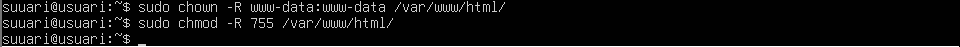

### Pas 3: Execució de la prova d'accés (VM Víctima)

- Obrir el navegador web a la VM Víctima.

- Introduir a la barra d'adreces la IP del servidor LAMP: ``http://[IP_DEL_SERVIDOR]``

- Verificar que es mostra el missatge **"Benvingut al Servidor d'Auditoria".**

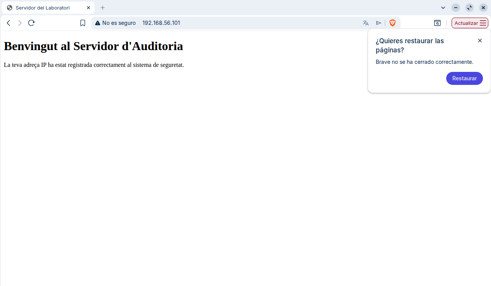

### Pas 4: Verificació de la traça a la Base de Dades (VM Servidor)

Tornar a la terminal de la VM Servidor per comprovar que la IP de la víctima ha estat emmagatzemada correctament a la taula d'auditoria:

- **Accedir a la consola de MariaDB:**

```
sudo mariadb -u root
```

- Executar la consulta SQL per veure els registres capturats:

```
USE lab_db;
```
```
SELECT * FROM registres;
```

- **Comprovar la sortida:** Ha d'aparèixer una nova fila amb l'id, l'adreça ip exacta de la VM Víctima, la data/hora automàtica i el text de detall.

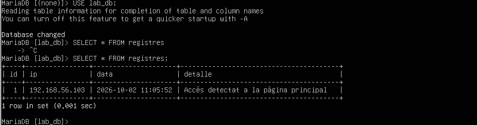

