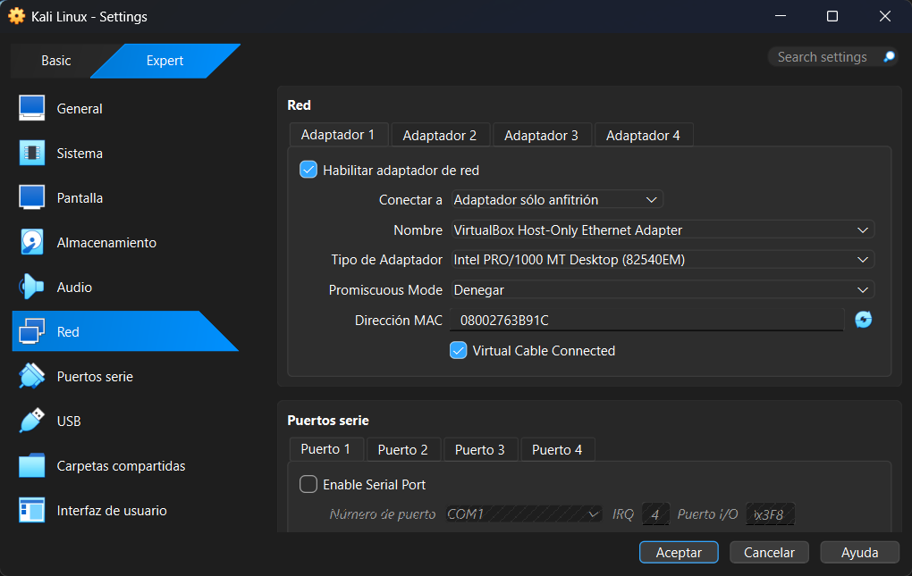
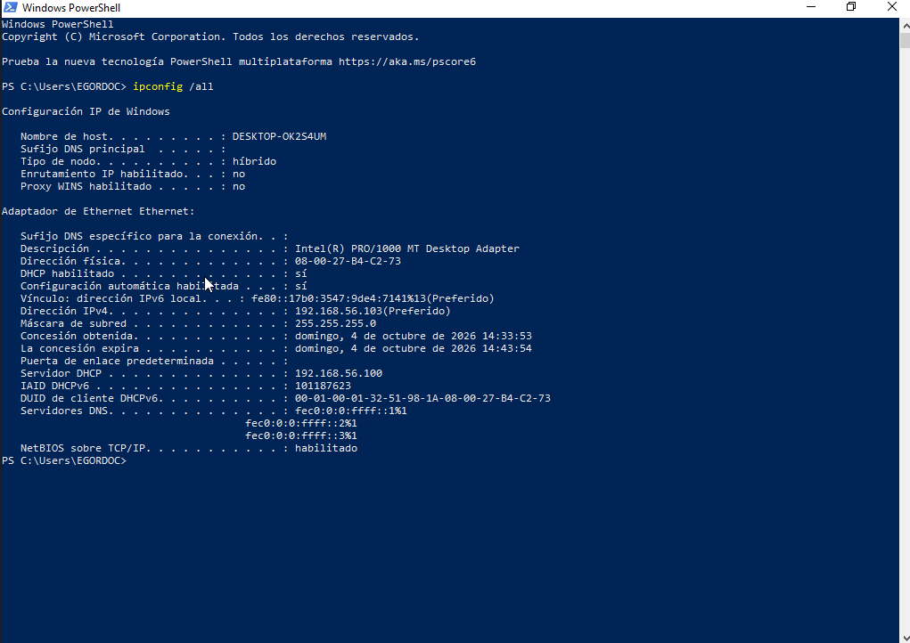
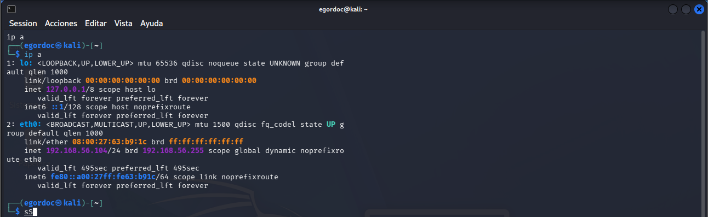
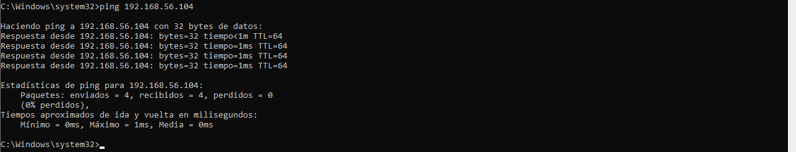
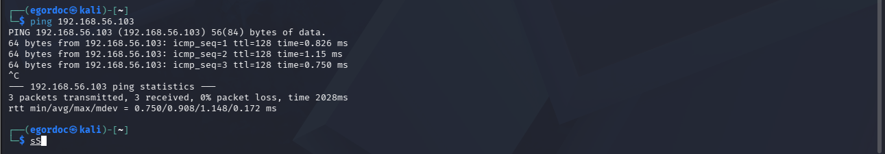

# 💊 Preparació de la Màquina Virtual
## Edu Gordo | CASIX 1r 26 - 27

---

## Evidència 1: Connectant Màquines virtuals

### - Configurar Windows i Kali perquè comparteixin una xarxa i es puguin comunicar. Mostra amb dues configuracions diferents d'adaptador que permetin que es comuniquin entre elles i digues quina creus que caldria utilitzar per aïllar la xarxa.

### - Identificar IP, màscara, gateway, DNS i MAC de la màquina Windows i de la màquina Kali.

| Paràmetre | Windows | Kali |
| :--- | :--- | :--- |
| **IP** | 192.168.56.103 | 192.168.56.104 |
| **Màscara** | 255.255.255.0 | 255.255.255.0 |
| **Gateway** | 192.168.56.255 | 192.168.56.255 |
| **DNS** | - | - |
| **MAC** | 08-00-27-B4-C2-73 | 08:00:27:63:B9:1C |

### - Comprovar la comunicació Windows → Kali amb la comanda ping per als dos tipus d'adaptador.

### - Comprovar la comunicació Kali → Windows amb la comanda ping per als dos tipus d'adaptador.

### - Investigar qualsevol ping que no funcioni i determinar si el problema és de xarxa o de tallafoc (Windows per defecte bloqueja els pings des del tallafocs).

---

