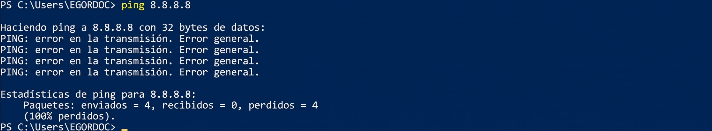
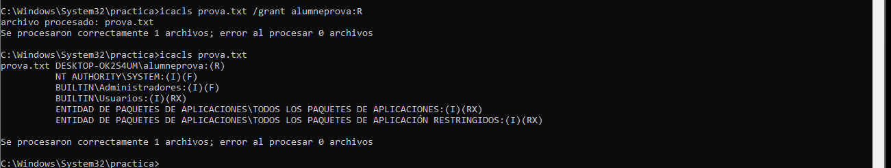
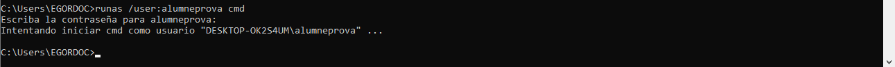
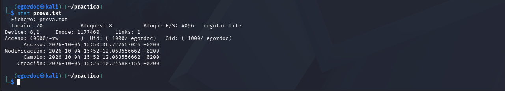
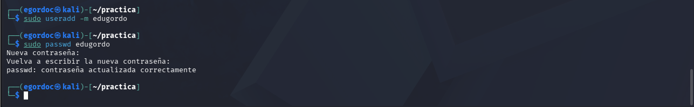

# 💊 Preparació de la Màquina Virtual

## Edu Gordo | CASIX 1r 26 - 27

***

## Evidència 1: Connectant Màquines virtuals

### - Configurar Windows i Kali perquè comparteixin una xarxa i es puguin comunicar. Mostra amb dues configuracions diferents d'adaptador que permetin que es comuniquin entre elles i digues quina creus que caldria utilitzar per aïllar la xarxa.

.png>) .png>)

### - Identificar IP, màscara, gateway, DNS i MAC de la màquina Windows i de la màquina Kali.

.png>) .png>)

| Paràmetre   | Windows           | Kali              |
| ----------- | ----------------- | ----------------- |
| **IP**      | 192.168.56.103    | 192.168.56.104    |
| **Màscara** | 255.255.255.0     | 255.255.255.0     |
| **Gateway** | 192.168.56.255    | 192.168.56.255    |
| **DNS**     | -                 | -                 |
| **MAC**     | 08-00-27-B4-C2-73 | 08:00:27:63:B9:1C |

### - Comprovar la comunicació Windows → Kali amb la comanda ping per als dos tipus d'adaptador.

.png>)

### - Comprovar la comunicació Kali → Windows amb la comanda ping per als dos tipus d'adaptador.

.png>)

### - Investigar qualsevol ping que no funcioni i determinar si el problema és de xarxa o de tallafoc (Windows per defecte bloqueja els pings des del tallafocs).



Si volem desactivar el tallafocs per no bloquejar els pings haurem d'utilitzar la següent comanda:

```
netsh advfirewall set allprofiles state off
```

***

## Evidència 2: Comandes bàsiques

### Crea una carpeta anomenada practica a Linux amb mkdir practica i entra-hi amb cd practica. Comprova on ets amb pwd i mostra’n el contingut amb ls.

.png>)

### - Repeteix els passos a Windows (CMD) amb mkdir practica, cd practica, cd i dir.

.png>)

### - Dins de la carpeta, crea prova.txt amb echo Hola > prova.txt en tots dos sistemes. Mostra’n el contingut amb cat prova.txt a Linux i type prova.txt a Windows. Copia el fitxer amb cp prova.txt copia.txt a Linux i copy prova.txt copia.txt a Windows. Canvia el nom de la còpia amb mv copia.txt resultat.txt o ren copia.txt resultat.txt, segons el sistema. Comprova que hi hagi dos fitxers i esborra resultat.txt amb rm o del.

.png>) .png>)

### - Escriu dues línies diferents a prova.txt i cerca-hi una paraula amb grep a Linux i findstr a Windows. Mostra la data amb date a Linux i date /t a Windows. Consulta el teu nom d’usuari amb whoami en tots dos sistemes i mostra els processos actius amb ps a Linux i tasklist a Windows. Consulta les connexions de xarxa amb ss -tuln a Linux i netstat -an a Windows. Prepara una taula amb les parelles de comandes que has utilitzat i escriu, per a cadascuna, el resultat que has observat.

.png>) .png>) .png>) .png>) .png>) .png>)

### - A Kali Linux, executa nmap 127.0.0.1 per explorar el teu propi equip. Anota quins ports apareixen oberts i compara el resultat amb el de ss -tuln. Consulta les opcions de l’eina amb nmap --help i torna a explorar el mateix equip amb nmap -sV 127.0.0.1. Indica si ara apareix informació sobre els serveis. Acaba l’activitat lliurant la taula de comandes, les respostes sobre nmap i una captura o transcripció breu dels resultats.

.png>) .png>) .png>)

***

## Evidència 3: Permisos

### - A Linux, entra a la carpeta practica de l’exercici anterior i executa ls -l prova.txt i ls -ld .; anota el propietari, el grup i els permisos de lectura (r), escriptura (w) i execució (x) que té cadascun. Aplica chmod 600 prova.txt, intenta llegir-lo amb cat prova.txt i afegeix-hi una línia amb echo Prova >> prova.txt. Després, retira’t el permís d’escriptura amb chmod u-w prova.txt i torna a intentar afegir-hi una línia. Anota el resultat i recupera el permís amb chmod u+w prova.txt. Crea la carpeta privada dins de practica, aplica-hi chmod 700 privada i comprova’n els permisos amb ls -ld privada. En un equip de pràctiques on tinguis permisos d’administració, crea un segon usuari amb sudo useradd -m alumneprova i assigna-li una contrasenya amb sudo passwd alumneprova.

.png>) .png>) .png>)

### - A Windows, entra a la carpeta practica que vas crear i consulta els permisos de prova.txt amb icacls prova.txt. Crea també una carpeta privada amb mkdir privada i consulta’n els permisos amb icacls privada. Obre CMD com a administrador i crea un usuari local amb net user alumneprova \* /add; escriu la contrasenya quan se’t demani. Torna a practica i concedeix-li permís de lectura sobre el fitxer amb icacls prova.txt /grant alumneprova:R. Consulta de nou els permisos amb icacls prova.txt. Obre una consola amb el compte nou mitjançant runas /user:.\alumneprova cmd, entra a practica i prova de llegir prova.txt amb type prova.txt i de modificar-lo amb echo Prova >> prova.txt. Anota què permet fer cada prova.

.png>) .png>)  .png>) 

### - A Kali Linux, treballa dins de la carpeta practica de l’exercici anterior. Consulta prova.txt amb stat prova.txt i compara’n la sortida amb ls -l prova.txt. Crea (substitueix nomalumne pel teu nom i cognom) amb sudo useradd -m nomalumne i sudo passwd alumneprova. Aplica chmod 644 prova.txt i prova de llegir el fitxer com a usuari nou amb sudo -u alumneprova cat prova.txt; intenta també modificar-lo amb sudo -u alumneprova sh -c 'echo Prova >> prova.txt'. Repeteix les dues proves després d’aplicar chmod 640 prova.txt i, finalment, chmod 600 prova.txt. Si el segon usuari no pot arribar fins al fitxer, consulta els permisos de la carpeta practica amb ls -ld . i anota aquesta causa. Lliura una taula amb cada configuració provada, els permisos de prova.txt i privada, l’usuari que ha fet la prova i si ha pogut llegir, escriure o entrar a la carpeta.

  .png>) .png>) .png>)
